**Dokumen Desain Jaringan: Perancangan & Implementasi Jaringan Enterprise PT. Nusantara Network**

**Deliverable Pekan 11 - Mata Kuliah Desain & Manajemen Jaringan Komputer**

**Disusun oleh Kelompok 8:**

1.  **Adhitya Hermawan** - Network Architect
2.  **Achmad Zaki Zaidan** - Network Engineer
3.  **Amalia Tiara Rezfani** - Network Services Specialist
4.  **Faradila Zakiah Nur Hafitsa** - Security & Documentation Specialist

**Tanggal Pengumpulan:** Jumat, [Pekan 11], [2025]

---

**Daftar Isi**
 1. Link File Simulasi
 2. Screenshot Topologi & Penjelasan
 3. Dokumentasi Konfigurasi CLI
 4. Hasil Pengujian Konektivitas


---
## 1. Link File Simulasi
[Unduh File Simulasi .pkt](https://link-to-your-file.com)

## 2. Screenshot Topologi & Penjelasan

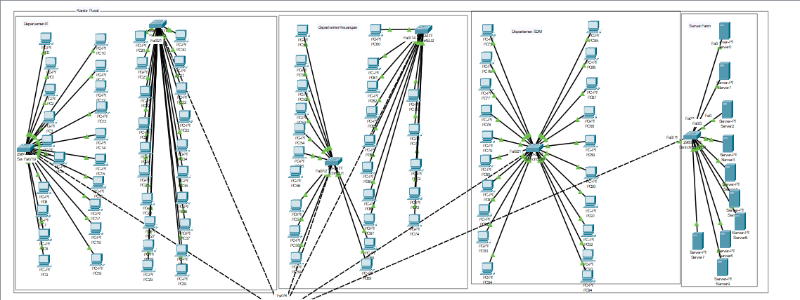
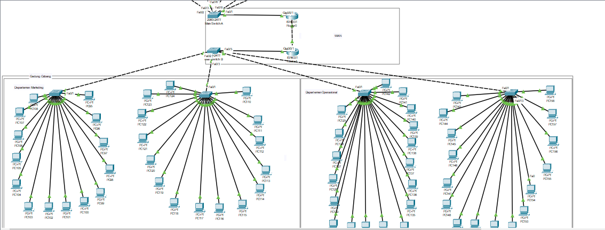
**Penjelasan:**
Topologi ini menunjukkan implementasi jaringan berbasis VLAN (Virtual Local Area Network) di dua lokasi fisik: **Gedung A** dan **Gedung B**, yang terhubung melalui **Core Router**. Konfigurasi ini bertujuan untuk membagi lalu lintas jaringan menjadi beberapa segmen logis (VLAN) berdasarkan departemen atau fungsionalitas tertentu, sambil memastikan komunikasi yang efisien antar-VLAN dan antar-lokasi.

---

### **Komponen Utama dalam Topologi**

#### **A. Core Router**
- **Fungsi**: Core Router adalah inti dari topologi ini, bertindak sebagai pusat penghubung utama antara kedua gedung dan menyediakan routing antar-VLAN serta koneksi ke Internet.
- **Konfigurasi VLAN**:
  - Core Router memiliki sub-interface untuk masing-masing VLAN.
  - Sub-interface ini digunakan untuk routing antar-VLAN dan mengizinkan komunikasi antar-departemen.
- **Koneksi Trunk**:
  - Core Router terhubung ke **Main Switch A** dan **Main Switch B** menggunakan trunk port (`GigabitEthernet0/0/1`) untuk mendukung semua VLAN yang diperlukan.

#### **B. Main Switch A (Gedung A)**
- **Fungsi**: Main Switch A adalah switch layer 3 yang mengelola semua VLAN di Gedung A.
- **Port Konfigurasi**:
  - Port akses (access ports) dikonfigurasi untuk setiap VLAN sesuai dengan departemen:
    - **VLAN 10**: Departemen IT
    - **VLAN 20**: Departemen Keuangan
    - **VLAN 30**: Departemen SDM
    - **VLAN 40**: Server Farm
  - Port trunk (`FastEthernet0/1`) terhubung ke Core Router untuk mengizinkan semua VLAN melewati koneksi tersebut.
- **VLAN Configuration**:
  - Setiap VLAN telah dibuat dan diberi nama sesuai dengan departemen:
    - VLAN 10: `VLAN_IT`
    - VLAN 20: `VLAN_KEU`
    - VLAN 30: `VLAN_SDM`
    - VLAN 40: `VLAN_SERVER`

#### **C. Main Switch B (Gedung B)**
- **Fungsi**: Main Switch B adalah switch layer 3 yang mengelola semua VLAN di Gedung B.
- **Port Konfigurasi**:
  - Port akses (access ports) dikonfigurasi untuk setiap VLAN sesuai dengan departemen:
    - **VLAN 50**: Departemen Marketing
    - **VLAN 60**: Departemen Operasional
  - Port trunk (`FastEthernet0/1`) terhubung ke Core Router untuk mengizinkan semua VLAN melewati koneksi tersebut.
- **VLAN Configuration**:
  - Setiap VLAN telah dibuat dan diberi nama sesuai dengan departemen:
    - VLAN 50: `VLAN_MKT`
    - VLAN 60: `VLAN_OPS`

#### **D. Access Switches**
- **Fungsi**: Access Switches digunakan untuk menyediakan koneksi langsung ke perangkat end-user seperti PC di setiap departemen.
- **Port Konfigurasi**:
  - Semua port access switch dikonfigurasi sebagai **access port** untuk VLAN yang relevan.
  - Misalnya:
    - Departemen IT: Semua port di konfigurasi untuk VLAN 10.
    - Departemen Keuangan: Semua port di konfigurasi untuk VLAN 20.
    - Departemen SDM: Semua port di konfigurasi untuk VLAN 30.
    - Departemen Marketing: Semua port di konfigurasi untuk VLAN 50.
    - Departemen Operasional: Semua port di konfigurasi untuk VLAN 60.

#### **E. Server Farm**
- **Fungsi**: Server Farm berisi server-server penting seperti DHCP/DNS Server, Database Server, dan lainnya.
- **Konfigurasi VLAN**:
  - Semua server dalam Server Farm terhubung ke Main Switch A melalui VLAN 40 (`VLAN_SERVER`).

#### **F. Koneksi Antara Gedung**
- **Trunk Connection**:
  - Koneksi antara **Main Switch A** dan **Core Router**, serta **Main Switch B** dan **Core Router**, menggunakan **trunk port** untuk mendukung semua VLAN yang diperlukan.
  - Ini memungkinkan komunikasi antar-VLAN dan antar-gedung tanpa batasan.

#### **G. NAT (Network Address Translation)**
- **Fungsi**: Core Router juga dilengkapi dengan NAT untuk mengatur koneksi ke Internet.
- **Konfigurasi**:
  - Interface eksternal Core Router (`GigabitEthernet0/0/0`) diatur sebagai NAT outside.
  - Interface internal Core Router (`GigabitEthernet0/0/1`) diatur sebagai NAT inside.
  - Access List (ACL) digunakan untuk mengatur alamat IP yang dapat melakukan NAT.

---

### **3. Implementasi VLAN**
#### **A. Pembagian VLAN Berdasarkan Departemen**
- **Gedung A**:
  - **VLAN 10**: Departemen IT
  - **VLAN 20**: Departemen Keuangan
  - **VLAN 30**: Departemen SDM
  - **VLAN 40**: Server Farm
- **Gedung B**:
  - **VLAN 50**: Departemen Marketing
  - **VLAN 60**: Departemen Operasional

#### **B. Native VLAN**
- **Native VLAN** adalah VLAN default yang digunakan oleh lalu lintas untagged (untagged traffic). Untuk menghindari konflik native VLAN, ada beberapa hal yang harus di pastikan, yaitu:
  - Port trunk di kedua sisi koneksi memiliki **native VLAN yang sama**.
  - Contoh: Jika port trunk di Main Switch A menggunakan native VLAN 10, maka port trunk di  Switch departemen IT yang terhubung harus juga menggunakan native VLAN 10.

#### **C. Routing Antar-VLAN**
- **Sub-Interface pada Core Router**:
  - Core Router menggunakan sub-interface untuk mendukung routing antar-VLAN.
  - Setiap sub-interface diatur untuk VLAN tertentu, misalnya:
    - `GigabitEthernet0/0/1.10`: VLAN 10
    - `GigabitEthernet0/0/1.20`: VLAN 20
    - `GigabitEthernet0/0/1.30`: VLAN 30
    - `GigabitEthernet0/0/1.40`: VLAN 40
    - `GigabitEthernet0/0/1.50`: VLAN 50
    - `GigabitEthernet0/0/1.60`: VLAN 60

#### **D. Spanning Tree Protocol (STP)**
- STP digunakan untuk menghindari loop dalam jaringan Ethernet.
- **Port FastEthernet0/1** di Main Switch A dan Main Switch B diaktifkan sebagai trunk port untuk mendukung semua VLAN yang diperlukan.

---

## 3.  Dokumentasi Konfigurasi CLI

###  Router Configuration


#### Router 1
```bash
Router(config)#interface GigabitEthernet0/0/1
Router(config-if)#
Router(config-if)#exit
Router(config)#interface GigabitEthernet0/0/0
Router(config-if)#
Router(config-if)#exit
Router(config)#interface GigabitEthernet0/0/2
Router(config-if)#
Router(config-if)#exit
Router(config)#interface GigabitEthernet0/0/1
Router(config-if)#encapsulation dot1Q 10
Router(config-if)#exit
Router(config)#interface GigabitEthernet0/0/1.10
Router(config-subif)#encapsulation dot1Q 10
Router(config-subif)#ip address 192.168.10.1 255.255.255.0
Router(config-subif)#no shutdown
Router(config-subif)#exit
Router(config)#exit

Router#write memory
Building configuration...
[OK]

Router#configure terminal
Enter configuration commands, one per line.  End with CNTL/Z.
Router(config)#interface GigabitEthernet0/0/0
Router(config-if)#ip address 192.168.99.2 255.255.255.0
Router(config-if)#no shutdown
Router(config-if)#exit
Router(config)#interface GigabitEthernet0/0/1.10
Router(config-subif)#encapsulation dot1Q 10
Router(config-subif)#ip address 192.168.10.1 255.255.255.0
Router(config-subif)#no shutdown
Router(config-subif)#exit
Router(config)#interface GigabitEthernet0/0/1.20
Router(config-subif)#encapsulation dot1Q 20
Router(config-subif)#ip address 192.168.20.1 255.255.255.0
Router(config-subif)#no shutdown
Router(config-subif)#exit
Router(config)#interface GigabitEthernet0/0/1.30
Router(config-subif)#encapsulation dot1Q 30
Router(config-subif)#ip address 192.168.30.1 255.255.255.0
Router(config-subif)#no shutdown
Router(config-subif)#exit
Router(config)#interface GigabitEthernet0/0/1.40
Router(config-subif)#encapsulation dot1Q 40
Router(config-subif)#ip address 192.168.40.1 255.255.255.0
Router(config-subif)#no shutdown
Router(config-subif)#exit
Router(config)#interface GigabitEthernet0/0/1.50
Router(config-subif)#encapsulation dot1Q 50
Router(config-subif)#ip address 192.168.50.1 255.255.255.0
Router(config-subif)#no shutdown
Router(config-subif)#exit
Router(config)#interface GigabitEthernet0/0/1.60
Router(config-subif)#encapsulation dot1Q 60
Router(config-subif)#ip address 192.168.60.1 255.255.255.0
Router(config-subif)#no shutdown
Router(config-subif)#exit
Router(config)#router ospf 1
Router(config-router)#network 192.168.99.0 0.0.0.255 area 0
Router(config-router)#network 192.168.10.0 0.0.0.255 area 1
Router(config-router)#network 192.168.20.0 0.0.0.255 area 1
Router(config-router)#network 192.168.30.0 0.0.0.255 area 1
Router(config-router)#network 192.168.40.0 0.0.0.255 area 1
Router(config-router)#network 192.168.50.0 0.0.0.255 area 2
Router(config-router)#network 192.168.60.0 0.0.0.255 area 2
Router(config-router)#exit
Router(config)#exit

Router#write memory
Building configuration...
[OK]

Router#show ip interface brief
Interface               IP-Address      OK? Method Status                Protocol 
GigabitEthernet0/0/0    192.168.99.2    YES manual up                    up 
GigabitEthernet0/0/0.10 unassigned      YES unset  up                    up 
GigabitEthernet0/0/1    unassigned      YES unset  up                    up 
GigabitEthernet0/0/1.10 192.168.10.1
```
---
#### Router 0

```bash
Router>enable
Router#configure terminal
Enter configuration commands, one per line.  End with CNTL/Z.
Router(config)#interface GigabitEthernet0/0/0
Router(config-if)#ip address 203.0.113.1 255.255.255.0
Router(config-if)#no shutdown

Router(config-if)#interface GigabitEthernet0/0/1
Router(config-if)#ip address 192.168.99.1 255.255.255.0
Router(config-if)#no shutdown

Router(config-if)#router ospf 1
Router(config-router)#network 192.168.99.0 0.0.0.255 area 0
Router(config-router)#network 203.0.113.0 0.0.0.255 area 0
Router(config-router)#exit
Router(config)#access-list 1 permit 192.168.0.0 0.0.255.255
Router(config)#ip nat inside source list 1 interface GigabitEthernet0/0/0 overload

Router(config)#interface GigabitEthernet0/0/1
Router(config-if)#ip nat inside
Router(config-if)#interface GigabitEthernet0/0/0
Router(config-if)#ip nat outside
Router(config-if)#exit
Router(config)#exit

Router#write memory
Building configuration...
[OK]

```
---
### Switch Configuration

#### Main Switch A

```bash
Switch>enable
Switch#show interfaces trunk

Switch#show vlan

VLAN Name                             Status    Ports
---- -------------------------------- --------- -------------------------------
1    default                          active    Fa0/3, Fa0/4, Fa0/5, Fa0/6
                                                Fa0/7, Fa0/8, Fa0/9, Fa0/10
                                                Fa0/11, Fa0/12, Fa0/13, Fa0/14
                                                Fa0/15, Fa0/16, Fa0/17, Fa0/18
                                                Fa0/19, Fa0/20, Fa0/21, Fa0/22
                                                Fa0/23, Fa0/24, Gig0/1, Gig0/2
10   VLAN_IT                          active    Fa0/2
20   VLAN_KEU                         active    
30   VLAN_SDM                         active    
40   VLAN_SERVER                      active    
99   VLAN_MGHT                        active    
1002 fddi-default                     active    
1003 token-ring-default               active    
1004 fddinet-default                  active    
1005 trnet-default                    active    

VLAN Type  SAID       MTU   Parent RingNo BridgeNo Stp  BrdgMode Trans1 Trans2
---- ----- ---------- ----- ------ ------ -------- ---- -------- ------ ------

Switch#show interfaces status
Port      Name               Status       Vlan       Duplex  Speed Type
Fa0/1                        connected    trunk      auto    auto  10/100BaseTX
Fa0/2                        connected    10         auto    auto  10/100BaseTX
Fa0/3                        connected    1          auto    auto  10/100BaseTX
Fa0/4                        notconnect   1          auto    auto  10/100BaseTX
Fa0/5                        connected    1          auto    auto  10/100BaseTX
Fa0/6                        connected    1          auto    auto  10/100BaseTX
Fa0/7                        connected    1          auto    auto  10/100BaseTX
Fa0/8                        connected    1          auto    auto  10/100BaseTX
Fa0/9                        notconnect   1          auto    auto  10/100BaseTX
Fa0/10                       notconnect   1          auto    auto  10/100BaseTX
Fa0/11                       notconnect   1          auto    auto  10/100BaseTX
Fa0/12                       notconnect   1          auto    auto  10/100BaseTX
Fa0/13                       notconnect   1          auto    auto  10/100BaseTX
Fa0/14                       notconnect   1          auto    auto  10/100BaseTX
Fa0/15                       notconnect   1          auto    auto  10/100BaseTX
Fa0/16                       notconnect   1          auto    auto  10/100BaseTX
Fa0/17                       notconnect   1          auto    auto  10/100BaseTX
Fa0/18                       notconnect   1          auto    auto  10/100BaseTX
Fa0/19                       notconnect   1          auto    auto  10/100BaseTX
Fa0/20                       notconnect   1          auto    auto  10/100BaseTX
Fa0/21                       notconnect   1          auto    auto  10/100BaseTX

Switch#configure terminal
Enter configuration commands, one per line.  End with CNTL/Z.
Switch(config)#interface FastEthernet0/1
Switch(config-if)#switchport mode trunk
Switch(config-if)#switchport trunk allowed vlan 10,20,30,40,99
Switch(config-if)#exit
Switch(config)#exit
Switch#
%SYS-5-CONFIG_I: Configured from console by console

Switch#configure terminal
Enter configuration commands, one per line.  End with CNTL/Z.
Switch(config)#interface FastEthernet0/2
Switch(config-if)#switchport mode trunk
Switch(config-if)#switchport trunk allowed vlan 10
Switch(config-if)#exit
Switch(config)#exit
Switch#

Switch#configure terminal
Enter configuration commands, one per line.  End with CNTL/Z.
Switch(config)#interface FastEthernet0/3
Switch(config-if)#switchport mode trunk
Switch(config-if)#switchport trunk allowed vlan 10
Switch(config-if)#exit
Switch(config)#exit
Switch#

Switch#configure terminal
Enter configuration commands, one per line.  End with CNTL/Z.
Switch(config)#interface FastEthernet0/5
Switch(config-if)#switchport mode trunk
Switch(config-if)#switchport trunk allowed vlan 20
Switch(config-if)#exit
Switch(config)#exit
Switch#

Switch#configure terminal
Enter configuration commands, one per line.  End with CNTL/Z.
Switch(config)#interface FastEthernet0/6
Switch(config-if)#switchport mode trunk
Switch(config-if)#switchport trunk allowed vlan 20
Switch(config-if)#exit
Switch(config)#exit
Switch#

Switch#configure terminal
Enter configuration commands, one per line.  End with CNTL/Z.
Switch(config)#interface FastEthernet0/7
Switch(config-if)#switchport mode trunk
Switch(config-if)#switchport trunk allowed vlan 30
Switch(config-if)#exit
Switch(config)#exit
Switch#

Switch#configure terminal
Enter configuration commands, one per line.  End with CNTL/Z.
Switch(config)#interface FastEthernet0/8
Switch(config-if)#switchport mode trunk
Switch(config-if)#switchport trunk allowed vlan 40
Switch(config-if)#exit
Switch(config)#exit
Switch#
%SYS-5-CONFIG_I: Configured from console by console

Switch#show vlan brief

VLAN Name                             Status    Ports
---- -------------------------------- --------- -------------------------------
1    default                          active    Fa0/3, Fa0/4, Fa0/5, Fa0/6
                                                Fa0/7, Fa0/8, Fa0/9, Fa0/10
                                                Fa0/11, Fa0/12, Fa0/13, Fa0/14
                                                Fa0/15, Fa0/16, Fa0/17, Fa0/18
                                                Fa0/19, Fa0/20, Fa0/21, Fa0/22
                                                Fa0/23, Fa0/24, Gig0/1, Gig0/2
10   VLAN_IT                          active    Fa0/2
20   VLAN_KEU                         active    
30   VLAN_SDM                         active    
40   VLAN_SERVER                      active    
99   VLAN_MGHT                        active    
1002 fddi-default                     active    
1003 token-ring-default               active    
1004 fddinet-default                  active    
1005 trnet-default                    active    

```
---
#### Main Switch B

```bash
Switch>enable
Switch#configure terminal
Enter configuration commands, one per line.  End with CNTL/Z.
Switch(config)#vlan 50
Switch(config-vlan)#name VLAN_MKT
Switch(config-vlan)#exit
Switch(config)#vlan 60
Switch(config-vlan)#name VLAN_OPS
Switch(config-vlan)#vlan 99
Switch(config-vlan)#name VLAN_MGHT
Switch(config-vlan)#exit
Switch(config)#interface GigabitEthernet0/1
Switch(config-if)#switchport mode trunk
Switch(config-if)#switchport trunk allowed vlan 50,60,99
Switch(config-if)#exit
%SYS-5-CONFIG_I: Configured from console by console
Switch(config)#interface FastEthernet0/2
Switch(config-if)#switchport mode trunk
Switch(config-if)#switchport trunk allowed vlan 50
Switch(config-if)#exit
Switch(config)#exit
Switch#

Switch(config)#interface FastEthernet0/3
Switch(config-if)#switchport mode trunk
Switch(config-if)#switchport trunk allowed vlan 50
Switch(config-if)#exit
Switch(config)#exit
Switch#

Switch(config)#interface FastEthernet0/4
Switch(config-if)#switchport mode trunk
Switch(config-if)#switchport trunk allowed vlan 60
Switch(config-if)#exit
Switch(config)#exit
Switch#

Switch(config)#interface FastEthernet0/5
Switch(config-if)#switchport mode trunk
Switch(config-if)#switchport trunk allowed vlan 60
Switch(config-if)#exit
Switch(config)#exit
Switch#exit
Switch>show vlan brief
VLAN Name                             Status    Ports
---- -------------------------------- --------- -------------------------------
1    default                          active    Fa0/6, Fa0/7, Fa0/8, Fa0/9
                                                Fa0/10, Fa0/11, Fa0/12, Fa0/13
                                                Fa0/14, Fa0/15, Fa0/16, Fa0/17
                                                Fa0/18, Fa0/19, Fa0/20, Fa0/21
                                                Fa0/22, Fa0/23, Fa0/24, Gig0/1
                                                Gig0/2
50   VLAN_MKT                         active    Fa0/2, Fa0/3
60   VLAN_OPS                         active    Fa0/4, Fa0/5
99   VLAN_MGHT                        active    
1002 fddi-default                     active    
1003 token-ring-default               active    
1004 fddinet-default                  active    
1005 trnet-default                    active    
Switch>

Switch#write memory
Building configuration...
[OK]
```
#### switch it 1
```bash
Switch>enable
Switch#configure terminal

Switch(config)#vlan 10
Switch(config-vlan)#name VLAN_IT
Switch(config-vlan)#exit

Switch(config)#interface FastEthernet0/19
Switch(config-if)#switchport mode trunk
Switch(config-if)#switchport trunk allowed vlan 10
Switch(config-if)#switchport trunk native vlan 10
Switch(config-if)#exit

Switch(config)#interface range FastEthernet0/1 - 18
Switch(config-if-range)#switchport mode access
Switch(config-if-range)#switchport access vlan 10
Switch(config-if-range)#exit

Switch(config)#exit
Switch#write memory
Building configuration...
[OK]

Switch#show interfaces status
Port      Name               Status       Vlan       Duplex  Speed Type
Fa0/1                        connected    10         auto    auto  10/100BaseTX
Fa0/2                        connected    10         auto    auto  10/100BaseTX
Fa0/3                        connected    10         auto    auto  10/100BaseTX
Fa0/4                        connected    10         auto    auto  10/100BaseTX
Fa0/5                        connected    10         auto    auto  10/100BaseTX
Fa0/6                        connected    10         auto    auto  10/100BaseTX
Fa0/7                        connected    10         auto    auto  10/100BaseTX
Fa0/8                        connected    10         auto    auto  10/100BaseTX
Fa0/9                        connected    10         auto    auto  10/100BaseTX
Fa0/10                       connected    10         auto    auto  10/100BaseTX
Fa0/11                       connected    10         auto    auto  10/100BaseTX
Fa0/12                       connected    10         auto    auto  10/100BaseTX
Fa0/13                       connected    10         auto    auto  10/100BaseTX
Fa0/14                       connected    10         auto    auto  10/100BaseTX
Fa0/15                       connected    10         auto    auto  10/100BaseTX
Fa0/16                       connected    10         auto    auto  10/100BaseTX
Fa0/17                       connected    10         auto    auto  10/100BaseTX
Fa0/18                       connected    10         auto    auto  10/100BaseTX
Fa0/19                       connected    trunk      auto    auto  10/100BaseTX
Fa0/20                       notconnect   1          auto    auto  10/100BaseTX
Fa0/21                       notconnect   1          auto    auto  10/100BaseTX

Switch#show interfaces trunk
Port        Mode         Encapsulation  Status        Native vlan
Fa0/19      on           802.1q         trunking      10

Port        Vlans allowed on trunk
Fa0/19      10

Port        Vlans allowed and active in management domain
Fa0/19      10

Port        Vlans in spanning tree forwarding state and not pruned
Fa0/19      10
```

#### switch it 2
```bash
Switch>enable
Switch#configure terminal

Switch(config)#vlan 10
Switch(config-vlan)#name VLAN_IT
Switch(config-vlan)#exit

Switch(config)#interface FastEthernet0/21
Switch(config-if)#switchport mode trunk
Switch(config-if)#switchport trunk allowed vlan 10
Switch(config-if)#switchport trunk native vlan 10
Switch(config-if)#exit

Switch(config)#interface range FastEthernet0/1 - 20
Switch(config-if-range)#switchport mode access
Switch(config-if-range)#switchport access vlan 10
Switch(config-if-range)#exit

Switch(config)#exit
Switch#write memory
Building configuration...
[OK]

Switch#show interfaces status
Port      Name               Status       Vlan       Duplex  Speed Type
Fa0/1                        connected    10         auto    auto  10/100BaseTX
Fa0/2                        connected    10         auto    auto  10/100BaseTX
Fa0/3                        connected    10         auto    auto  10/100BaseTX
Fa0/4                        connected    10         auto    auto  10/100BaseTX
Fa0/5                        connected    10         auto    auto  10/100BaseTX
Fa0/6                        connected    10         auto    auto  10/100BaseTX
Fa0/7                        connected    10         auto    auto  10/100BaseTX
Fa0/8                        connected    10         auto    auto  10/100BaseTX
Fa0/9                        connected    10         auto    auto  10/100BaseTX
Fa0/10                       connected    10         auto    auto  10/100BaseTX
Fa0/11                       connected    10         auto    auto  10/100BaseTX
Fa0/12                       connected    10         auto    auto  10/100BaseTX
Fa0/13                       connected    10         auto    auto  10/100BaseTX
Fa0/14                       connected    10         auto    auto  10/100BaseTX
Fa0/15                       connected    10         auto    auto  10/100BaseTX
Fa0/16                       connected    10         auto    auto  10/100BaseTX
Fa0/17                       connected    10         auto    auto  10/100BaseTX
Fa0/18                       connected    10         auto    auto  10/100BaseTX
Fa0/19                       connected    10         auto    auto  10/100BaseTX
Fa0/20                       connected    10         auto    auto  10/100BaseTX
Fa0/21                       connected    trunk      auto    auto  10/100BaseTX
```

#### switch keu 1
```bash
Switch>enable
Switch#configure terminal
Enter configuration commands, one per line.  End with CNTL/Z.
Switch(config)#vlan 20
Switch(config-vlan)#name VLAN_KEU
Switch(config-vlan)#exit
Switch(config)#interface FastEthernet0/12
Switch(config-if)#switchport mode trunk
Switch(config-if)#switchport trunk allowed vlan 20
Switch(config-if)#switchport trunk native vlan 20
Switch(config-if)#exit
Switch(config)#interface range FastEthernet0/1 - 11
Switch(config-if-range)#switchport mode access
Switch(config-if-range)#switchport access vlan 20
Switch(config-if-range)#exit
Switch(config)#exit
Switch#
%SYS-5-CONFIG_I: Configured from console by console
Switch#write memory
Building configuration...
[OK]
```

#### switch keu 2

```bash
Switch>enable
Switch#configure terminal
Enter configuration commands, one per line.  End with CNTL/Z.
Switch(config)#vlan 20
Switch(config-vlan)#name VLAN_KEU
Switch(config-vlan)#exit
Switch(config)#interface FastEthernet0/14
Switch(config-if)#switchport mode trunk
Switch(config-if)#switchport trunk allowed vlan 20
Switch(config-if)#switchport trunk native vlan 20
Switch(config-if)#exit
Switch(config)#interface range FastEthernet0/1 - 13
Switch(config-if-range)#switchport mode access
Switch(config-if-range)#switchport access vlan 20
Switch(config-if-range)#exit
Switch(config)#exit
Switch#
%SYS-5-CONFIG_I: Configured from console by console
Switch#write memory
Building configuration...
[OK]
```

#### switch SDM

```bash
Switch>enable
Switch#configure terminal
Enter configuration commands, one per line.  End with CNTL/Z.
Switch(config)#vlan 30
Switch(config-vlan)#name VLAN_SDM
Switch(config-vlan)#exit
Switch(config)#interface FastEthernet0/21
Switch(config-if)#switchport mode trunk
Switch(config-if)#switchport trunk allowed vlan 30
Switch(config-if)#switchport trunk native vlan 30
Switch(config-if)#exit
Switch(config)#interface range FastEthernet0/1 - 20
Switch(config-if-range)#switchport mode access
Switch(config-if-range)#switchport access vlan 30
Switch(config-if-range)#exit
Switch(config)#exit
Switch#
%SYS-5-CONFIG_I: Configured from console by console
Switch#write memory
Building configuration...
[OK]
Switch#show interface status
Port      Name               Status       Vlan       Duplex  Speed Type
Fa0/1                        connected    30         auto    auto  10/100BaseTX
Fa0/2                        connected    30         auto    auto  10/100BaseTX
Fa0/3                        connected    30         auto    auto  10/100BaseTX
Fa0/4                        connected    30         auto    auto  10/100BaseTX
Fa0/5                        connected    30         auto    auto  10/100BaseTX
Fa0/6                        connected    30         auto    auto  10/100BaseTX
Fa0/7                        connected    30         auto    auto  10/100BaseTX
Fa0/8                        connected    30         auto    auto  10/100BaseTX
Fa0/9                        connected    30         auto    auto  10/100BaseTX
Fa0/10                       connected    30         auto    auto  10/100BaseTX
Fa0/11                       connected    30         auto    auto  10/100BaseTX
Fa0/12                       connected    30         auto    auto  10/100BaseTX
Fa0/13                       connected    30         auto    auto  10/100BaseTX
Fa0/14                       connected    30         auto    auto  10/100BaseTX
Fa0/15                       connected    30         auto    auto  10/100BaseTX
Fa0/16                       connected    30         auto    auto  10/100BaseTX
Fa0/17                       connected    30         auto    auto  10/100BaseTX
Fa0/18                       connected    30         auto    auto  10/100BaseTX
Fa0/19                       connected    30         auto    auto  10/100BaseTX
Fa0/20                       connected    30         auto    auto  10/100BaseTX
Fa0/21                       connected    trunk      auto    auto  10/100BaseTX
```

#### switch server

```bash
Switch>enable
Switch#configure terminal
Enter configuration commands, one per line.  End with CNTL/Z.
Switch(config)#vlan 40
Switch(config-vlan)#name VLAN_SERVER
Switch(config-vlan)#exit
Switch(config)#interface FastEthernet0/11
Switch(config-if)#switchport mode trunk
Switch(config-if)#
%LINEPROTO-5-UPDOWN: Line protocol on Interface FastEthernet0/11, changed state to down
%LINEPROTO-5-UPDOWN: Line protocol on Interface FastEthernet0/11, changed state to up
Switch(config-if)#switchport trunk allowed vlan 40
Switch(config-if)#switchport trunk native vlan 40
Switch(config-if)#exit
Switch(config)#interface range FastEthernet0/1 - 10
Switch(config-if-range)#switchport mode access
Switch(config-if-range)#switchport access vlan 40
Switch(config-if-range)#exit
Switch(config)#exit
Switch#
%SYS-5-CONFIG_I: Configured from console by console
Switch#write memory
Building configuration...
[OK]
```

#### switch mkt1
```bash
Switch>enable
Switch#configure terminal
Enter configuration commands, one per line.  End with CNTL/Z.
Switch(config)#vlan 50
Switch(config-vlan)#name VLAN_MKT
Switch(config-vlan)#exit
Switch(config)#interface FastEthernet0/1
Switch(config-if)#switchport mode trunk
Switch(config-if)#
%LINEPROTO-5-UPDOWN: Line protocol on Interface FastEthernet0/1, changed state to down
%LINEPROTO-5-UPDOWN: Line protocol on Interface FastEthernet0/1, changed state to up
Switch(config-if)#switchport trunk allowed vlan 50
Switch(config-if)#switchport trunk native vlan 50
Switch(config-if)#exit
Switch(config)#interface range FastEthernet0/2 - 15
Switch(config-if-range)#switchport mode access
Switch(config-if-range)#switchport access vlan 50
Switch(config-if-range)#exit
Switch(config)#exit
Switch#
%SYS-5-CONFIG_I: Configured from console by console
Switch#write memory
Building configuration...
[OK]
```

#### switch mkt2
```bash
Switch>enable
Switch#configure terminal
Enter configuration commands, one per line.  End with CNTL/Z.
Switch(config)#vlan 50
Switch(config-vlan)#name VLAN_MKT
Switch(config-vlan)#exit
Switch(config)#interface FastEthernet0/1
Switch(config-if)#switchport mode trunk
Switch(config-if)#
%LINEPROTO-5-UPDOWN: Line protocol on Interface FastEthernet0/1, changed state to down
%LINEPROTO-5-UPDOWN: Line protocol on Interface FastEthernet0/1, changed state to up
Switch(config-if)#switchport trunk allowed vlan 50
Switch(config-if)#switchport trunk native vlan 50
Switch(config-if)#exit
Switch(config)#interface range FastEthernet0/2 - 16
Switch(config-if-range)#switchport mode access
Switch(config-if-range)#switchport access vlan 50
Switch(config-if-range)#exit
Switch(config)#exit
Switch#
%SYS-5-CONFIG_I: Configured from console by console
Switch#write memory
Building configuration...
[OK]
```

#### switch ops1
```bash
Switch>enable
Switch#configure terminal
Enter configuration commands, one per line.  End with CNTL/Z.
Switch(config)#vlan 60
Switch(config-vlan)#name VLAN_OPS
Switch(config-vlan)#exit
Switch(config)#interface FastEthernet0/1
Switch(config-if)#switchport mode trunk
Switch(config-if)#
%LINEPROTO-5-UPDOWN: Line protocol on Interface FastEthernet0/1, changed state to down
%LINEPROTO-5-UPDOWN: Line protocol on Interface FastEthernet0/1, changed state to up
Switch(config-if)#switchport trunk allowed vlan 60
Switch(config-if)#switchport trunk native vlan 60
Switch(config-if)#exit
Switch(config)#interface range FastEthernet0/2 - 19
Switch(config-if-range)#switchport mode access
Switch(config-if-range)#switchport access vlan 60
Switch(config-if-range)#exit
Switch(config)#exit
Switch#
%SYS-5-CONFIG_I: Configured from console by console
Switch#write memory
Building configuration...
[OK]
```
#### switch ops2
```bash
Switch>enable
Switch#configure terminal
Enter configuration commands, one per line.  End with CNTL/Z.
Switch(config)#vlan 60
Switch(config-vlan)#name VLAN_OPS
Switch(config-vlan)#exit
Switch(config)#interface FastEthernet0/1
Switch(config-if)#switchport mode trunk
Switch(config-if)#
%LINEPROTO-5-UPDOWN: Line protocol on Interface FastEthernet0/1, changed state to down
%LINEPROTO-5-UPDOWN: Line protocol on Interface FastEthernet0/1, changed state to up
Switch(config-if)#switchport trunk allowed vlan 60
Switch(config-if)#switchport trunk native vlan 60
Switch(config-if)#exit
Switch(config)#interface range FastEthernet0/2 - 17
Switch(config-if-range)#switchport mode access
Switch(config-if-range)#switchport access vlan 60
Switch(config-if-range)#exit
Switch(config)#exit
Switch#
%SYS-5-CONFIG_I: Configured from console by console
Switch#write memory
Building configuration...
[OK]
```


## 4. Hasil Pengujian Konektivitas
### **1. Pengujian Konfigurasi VLAN**
### **Tujuan:**
Memastikan semua VLAN telah dikonfigurasi dengan benar dan port terhubung ke VLAN yang sesuai.

#### **Langkah 1.1: Verifikasi VLAN**
- **Deskripsi:** Periksa daftar VLAN yang ada di switch.
- **Perintah:**
  ```bash
  show vlan brief
  ```
- **Hasil yang Diharapkan:**
  - Semua VLAN yang dikonfigurasi muncul dalam daftar.
  - Port yang ditetapkan untuk setiap VLAN sesuai dengan desain.
- **Hasil Aktual:**
  Main switch A
  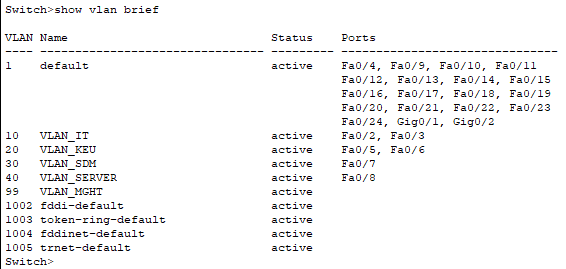

  hasil perintah show vlan brief di Switch pertama, yang menunjukkan bahwa telah dibuat beberapa VLAN seperti VLAN_IT (VLAN 10), VLAN_KEU (20), VLAN_SDM (30), dan VLAN_SERVER (40), serta VLAN_MGHT (99) yang kemungkinan digunakan sebagai VLAN manajemen. Setiap VLAN memiliki port tertentu yang ditugaskan, contohnya VLAN_IT terhubung ke port Fa0/2 dan Fa0/3, sedangkan VLAN default (1) masih memuat banyak port yang belum dipindahkan.

  Main switch B
  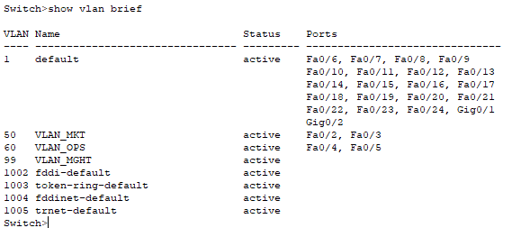

  show vlan brief di Switch kedua, di mana VLAN yang dibuat antara lain VLAN_MKT (50), VLAN_OPS (60), dan VLAN_MGHT (99). Port-port seperti Fa0/2 dan Fa0/3 masuk ke VLAN_MKT, sedangkan Fa0/4 dan Fa0/5 masuk ke VLAN_QBS. Sisanya masih berada di VLAN default (1). Ini menunjukkan bahwa konfigurasi VLAN telah disesuaikan sesuai kebutuhan departemen masing-masing.

  untuk swtich per departemennya memiliki hasil yang hampir sama, hanya saja VLAN yang berbeda dan port yang berbeda, berikut hasilnya:

  #### Switch Departemen IT

  Switch IT1
  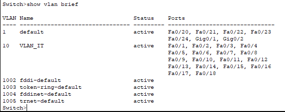

  Switch IT2
  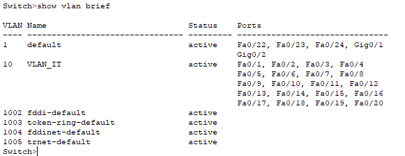

  #### Switch Departemen Keuangan

  Switch KEU1
  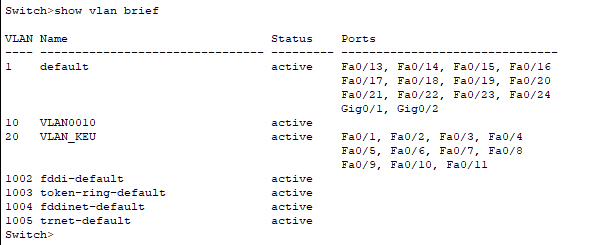

  Switch KEU2
  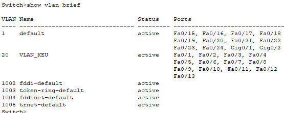

  #### Switch Departemen SDM
  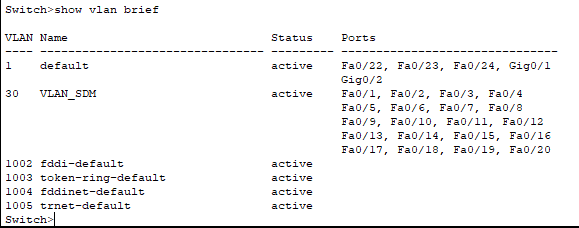

  #### Switch Server Farm
  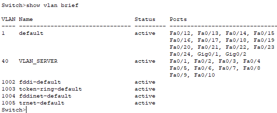

  #### Switch Departemen Marketing
  Switch MKT1

  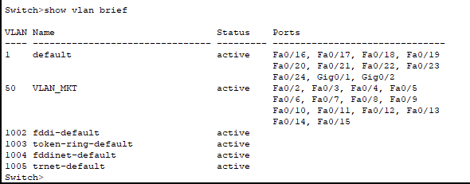

  Switch MKT2

  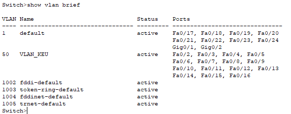

  #### Switch Departemen Operasional
  Switch OPS1

  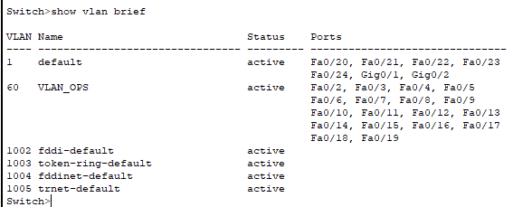

  Switch OPS2

  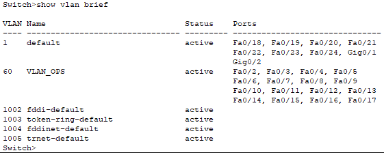


#### **Langkah 1.2: Verifikasi Status Port**
- **Deskripsi:** Periksa status port untuk memastikan port berada dalam mode dan VLAN yang benar.
- **Perintah:**
  ```bash
  show interfaces status
  ```
- **Hasil yang Diharapkan:**
  - Port trunk memiliki status `trunk` dan mengizinkan VLAN yang sesuai.
  - Port access memiliki status `connected` dan terhubung ke VLAN yang benar.
- **Hasil Aktual:**

  Main Switch A
  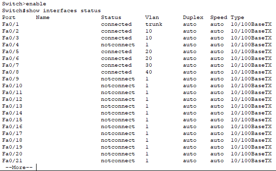

  perintah show interfaces status di Switch pertama. Terlihat bahwa Fa0/1 sudah dikonfigurasi sebagai trunk, artinya digunakan untuk menghubungkan antar switch dan membawa semua VLAN. Port lainnya seperti Fa0/2 sampai Fa0/8 berada dalam VLAN-VLAN yang telah dibuat, seperti Fa0/2 dan Fa0/3 di VLAN 10, Fa0/5 dan Fa0/6 di VLAN 20, dll. Status connected menunjukkan perangkat terhubung aktif, sedangkan notconnect berarti belum ada perangkat yang terhubung.

  Main Switch B
  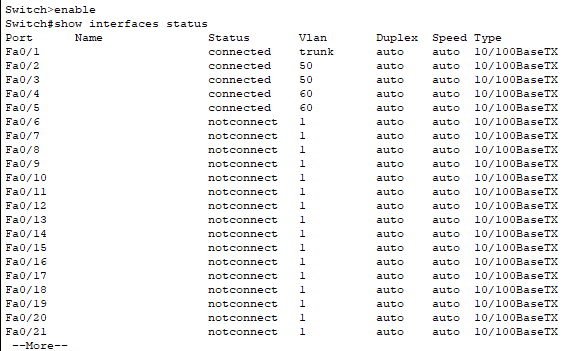

  Sama seperti switch pertama, port Fa0/1 berstatus trunk, sedangkan Fa0/2 dan Fa0/3 terhubung ke VLAN 50 (VLAN_MKT), dan Fa0/4 dan Fa0/5 ke VLAN 60 (VLAN_QBS). Port lain masih belum terkoneksi dan berada di VLAN default. Ini mendukung bahwa pengelompokan VLAN antar kedua switch telah dibuat dan siap digunakan.

  
  #### Switch Departemen IT
  Switch IT 1

  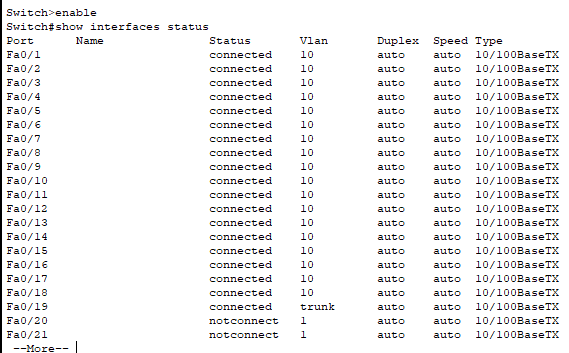

  Switch IT 2

  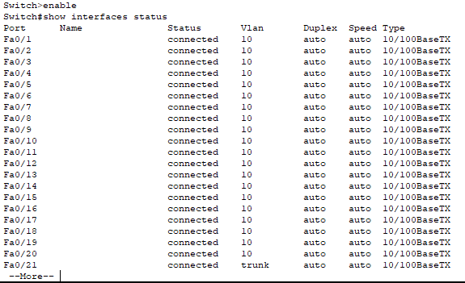

  #### Switch Departemen Keuangan
  Switch KEU1

  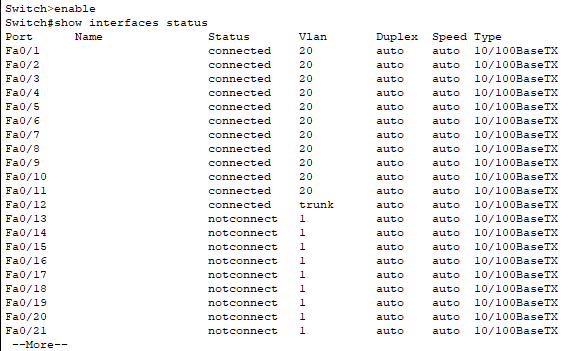

  Switch KEU2

  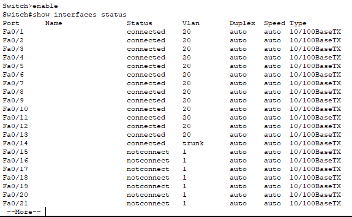

  #### Switch Departemen SDM
  Switch SDM

  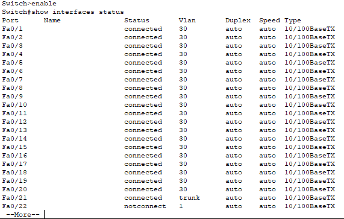

  #### Switch Server
  Server Farm

  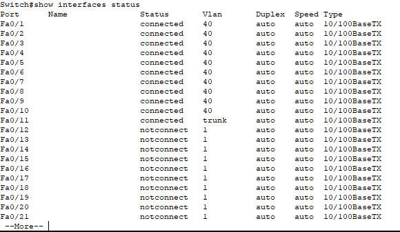

  #### Switch Departemen Marketing
  Switch MKT1

  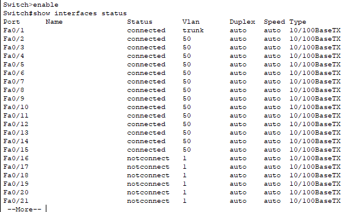

  Switch MKT2

  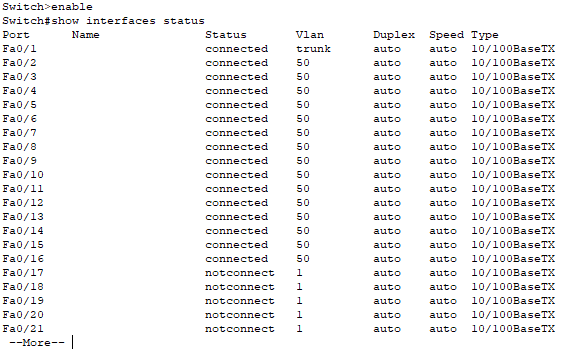


  #### Switch Departemen Operasional
  Switch OPS1

  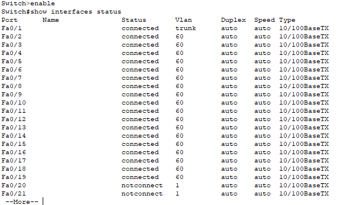

  Switch OPS2

  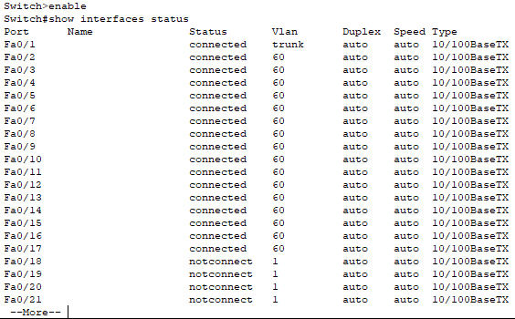

  


---

### **2. Pengujian Trunk Port**
### **Tujuan:**
Memastikan trunk port bekerja dengan baik dan mendukung semua VLAN yang diperlukan.

#### **Langkah 2.1: Verifikasi Trunk Port**
- **Deskripsi:** Periksa konfigurasi trunk port untuk memastikan VLAN yang diizinkan dan native VLAN sesuai.
- **Perintah:**
  ```bash
  show interfaces trunk
  ```
- **Hasil yang Diharapkan:**
  - Native VLAN pada kedua ujung trunk port sama.
  - Semua VLAN yang diperlukan terdaftar sebagai "Vlans allowed and active."
- **Hasil Aktual:**

  Main Switch A

  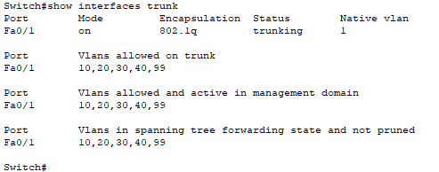

  output show interfaces trunk di Switch pertama, yang hampir sama seperti gambar sebelumnya. Namun daftar VLAN yang diizinkan lewat trunk lebih banyak, yaitu 10, 20, 30, 40, dan 99. Ini menunjukkan bahwa switch ini kemungkinan menjadi penghubung utama ke router atau server yang menangani banyak VLAN.

  Main Switch B

  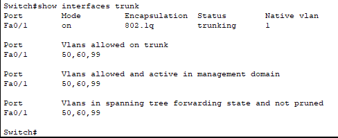

  Di sini terlihat bahwa port Fa0/1 sudah dalam mode trunk dengan encapsulation 802.1q, dan diatur agar VLAN 50, 60, dan 99 diizinkan lewat jalur trunk ini. Hal ini penting agar VLAN yang sama di switch berbeda bisa saling berkomunikasi via trunk.


  #### Switch Departemen IT

  Switch IT1

  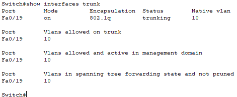

  Switch IT2

  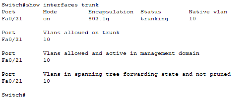

  #### Switch Departemen Keuangan

  Switch KEU1

  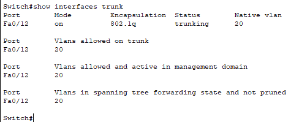

  Switch KEU2

  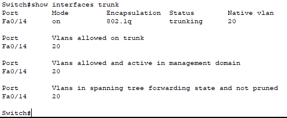

  #### Switch Departemen SDM
  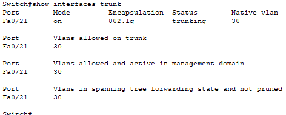

  #### Switch Server Farm
  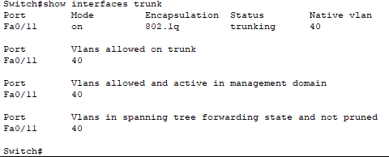

  #### Switch Departemen Marketing
  Switch MKT1

  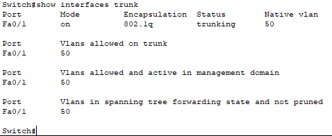

  Switch MKT2

  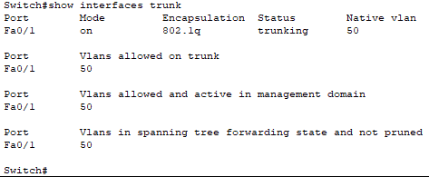

  #### Switch Departemen Operasional
  Switch OPS1

  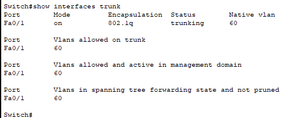

  Switch OPS2

  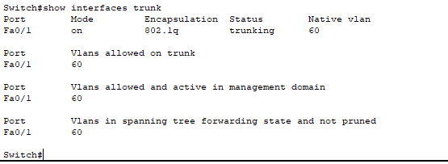

---

### **3. Pengujian OSPF dan Routing Antar-VLAN**
### **Tujuan:**
Memastikan routing antar-VLAN berfungsi dengan baik melalui OSPF.

#### **Langkah 3.1: Verifikasi OSPF Neighbors**
- **Deskripsi:** Periksa tetangga OSPF untuk memastikan router terhubung dengan benar.
- **Perintah:**
  ```bash
  show ip ospf interface
  ```
- **Hasil yang Diharapkan:**
     - Interface Status (is up, line protocol is up) :
    Pastikan interface OSPF dalam keadaan aktif (up). Jika interface tidak aktif, OSPF tidak akan bekerja.
    -  Internet Address :
    Alamat IP interface sesuai dengan subnet yang dikonfigurasi untuk OSPF (misalnya, `192.168.99.1/24`).
- **Hasil Aktual:**

  Router 1
  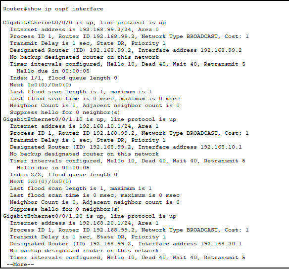
  menampilkan hasil perintah show ip ospf interface, yang menunjukkan bahwa protokol routing OSPF telah dikonfigurasi pada router. Setiap subinterface seperti GigabitEthernet0/0/0 dan GigabitEthernet0/1.10 memiliki OSPF aktif di area tertentu (area 0 atau area 1), dan router ini juga berperan sebagai Designated Router (DR) pada tiap-tiap jaringan. Ini menunjukkan bahwa jaringan ini bukan hanya VLAN statis tapi juga mendukung dynamic routing dengan OSPF.

  Router 0

  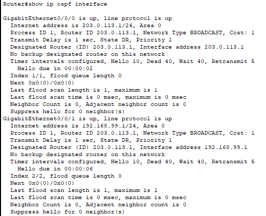
  detail konfigurasi dua interface GigabitEthernet, yaitu GigabitEthernet0/0/0 dan GigabitEthernet0/0/1. Data yang ditampilkan mencakup status protokol, alamat IP, ID router, tipe jaringan, biaya, waktu penundaan transmisi, ID router yang ditunjuk, interval hello timer, panjang antrian flood, jumlah tetangga OSPF, dan status hello. Informasi ini sangat berguna untuk menganalisis dan memantau kinerja protokol routing OSPF (Open Shortest Path First) di jaringan tersebut, sehingga administrator jaringan dapat memastikan konektivitas yang optimal antara perangkat-perangkat dalam jaringan OSPF.

#### **Langkah 3.2: Verifikasi Tabel Routing**
- **Deskripsi:** Periksa tabel routing untuk memastikan semua subnet VLAN dapat diakses.
- **Perintah:**
  ```bash
  show ip route
  ```
- **Hasil yang Diharapkan:**
  - Subnet VLAN muncul dalam tabel routing dengan gateway yang benar.
- **Hasil Aktual:**
  
  Route 0
  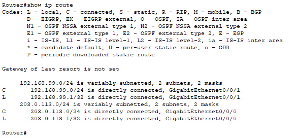

  menunjukkan hasil perintah show ip route pada router yang hanya memiliki dua jaringan terhubung, yaitu 192.168.99.0/24 dan 203.0.113.0/24. Masing-masing jaringan ini langsung terkoneksi ke interface GigabitEthernet router. Informasi ini berguna untuk menunjukkan bahwa routing antar jaringan dilakukan oleh router ini.

  Route 1
  
  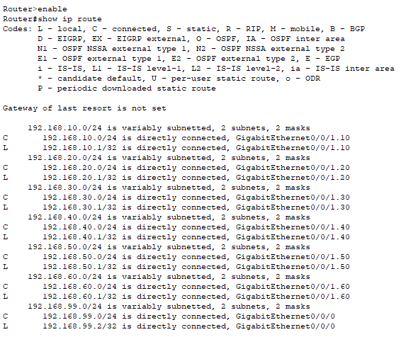

  versi lebih kompleks dari routing table, menampilkan banyak subnet VLAN seperti 192.168.10.0/24 sampai 192.168.60.0/24, yang semuanya terkoneksi langsung melalui subinterface di interface GigabitEthernet0/1. Hal ini menunjukkan bahwa router menggunakan metode Router-on-a-Stick, di mana satu interface fisik dipecah menjadi banyak subinterface untuk masing-masing VLAN.

---


###  Kendala & Solusi

#### Kendala:
- Trunking tidak aktif karena konfigurasi hanya dilakukan di satu sisi.
- IP address subinterface router salah ketik.

#### Solusi:
- Konfirmasi konfigurasi `switchport mode trunk` di kedua sisi koneksi antar switch/router.
- Periksa dan validasi kembali IP address dan subnet mask sesuai VLAN yang ditetapkan.
