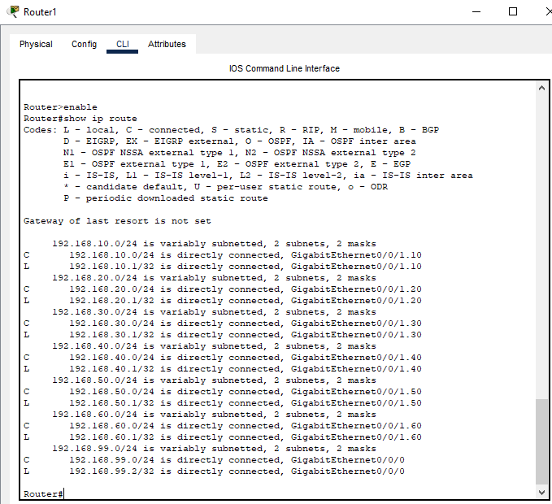
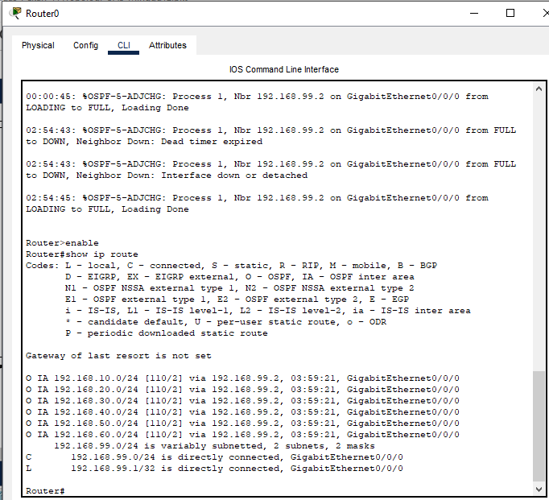
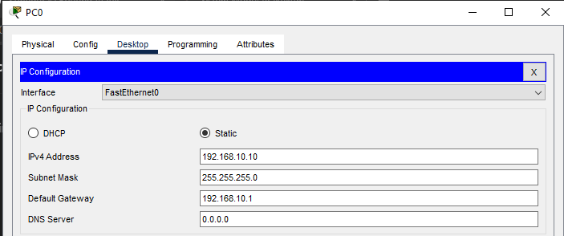
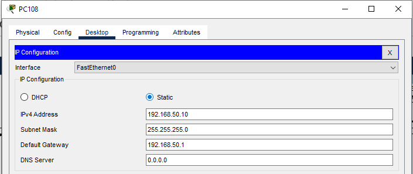
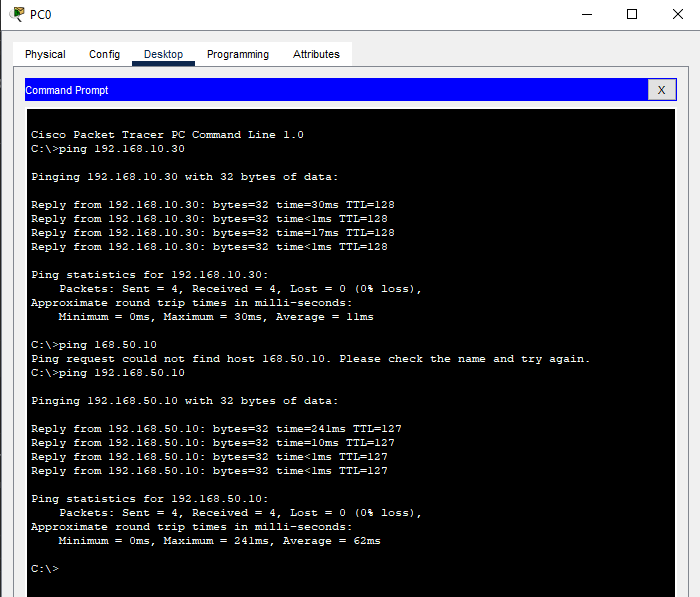
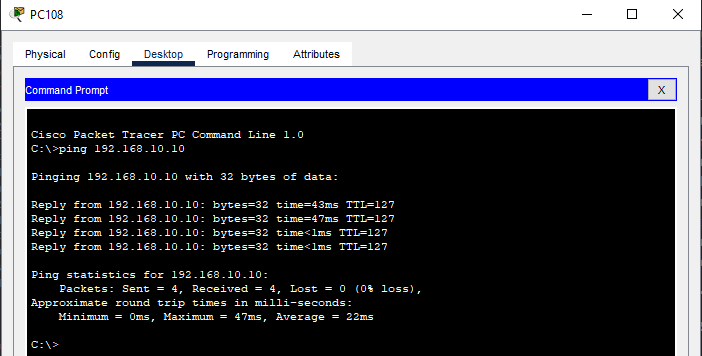

**Dokumen Desain Jaringan: Perancangan & Implementasi Jaringan Enterprise PT. Nusantara Network**

**Deliverable Pekan 12 - Mata Kuliah Desain & Manajemen Jaringan Komputer**

**Disusun oleh Kelompok 8:**

1.  **Adhitya Hermawan** - Network Architect
2.  **Achmad Zaki Zaidan** - Network Engineer
3.  **Amalia Tiara Rezfani** - Network Services Specialist
4.  **Faradila Zakiah Nur Hafitsa** - Security & Documentation Specialist

**Tanggal Pengumpulan:** Jumat, [Pekan 12], [2025]

---

**Daftar Isi**
 1. Link File Simulasi
 2. Konfigurasi CLI
 3. Screenshoot Table Routing
 4. Pengujian Konektivitas Antar-Gedung

### Pekan 12: Implementasi Routing & WAN

#### Tugas Kelompok

1. Konfigurasi routing statis pada jaringan intra-gedung.
2. Implementasi routing dinamis (OSPF) untuk koneksi antar-gedung.
3. Simulasi koneksi WAN antar gedung.

---

###  Link File Simulasi

 File simulasi Cisco Packet Tracer: \[Link ke file .pkt di Google Drive atau LMS]

---

###  Konfigurasi CLI

####  Routing Statis (Intra-Gedung)

 Digunakan di router-router lokal jika diperlukan untuk subnet yang tidak dicover otomatis oleh OSPF.

Contoh:
```bash
Router> enable
Router# configure terminal
Router(config)# ip route 192.168.10.0 255.255.255.0 192.168.1.1
Router(config)# ip route 192.168.20.0 255.255.255.0 192.168.1.2
Router(config)# end
```

Routing statis digunakan pada jaringan intra-gedung jika topologi mengharuskannya  misalnya, router departemen tambahan yang tidak ikut OSPF. Tapi Karena topologi kami tidak menggunakan router departemen tambahan, jadi untuk routing statis tidak diperlukan.

---

####  OSPF Configuration on Router0 (Core Router)

```bash
Router> enable
Router# configure terminal

! OSPF untuk antar-gedung
Router(config)# router ospf 1
Router(config-router)# router-id 1.1.1.1
Router(config-router)# network 192.168.99.0 0.0.0.255 area 0
Router(config-router)# network 203.0.113.0 0.0.0.255 area 0
Router(config-router)# exit
Router(config)# end
Router# write memory

```
---

####  OSPF Configuration on Router1 (Router VLAN)

```bash
Router> enable
Router# configure terminal
Router(config)# interface GigabitEthernet0/0/0
Router(config-if)# ip address 192.168.99.2 255.255.255.0
Router(config-if)# no shutdown
Router(config-if)# exit

Router(config)# interface GigabitEthernet0/0/1
Router(config-if)# no shutdown
Router(config-if)# exit

! Subinterfaces untuk masing-masing VLAN
Router(config)# interface GigabitEthernet0/0/1.10
Router(config-subif)# encapsulation dot1Q 10
Router(config-subif)# ip address 192.168.10.1 255.255.255.0
Router(config-subif)# no shutdown
Router(config-subif)# exit

Router(config)# interface GigabitEthernet0/0/1.20
Router(config-subif)# encapsulation dot1Q 20
Router(config-subif)# ip address 192.168.20.1 255.255.255.0
Router(config-subif)# no shutdown
Router(config-subif)# exit

Router(config)# interface GigabitEthernet0/0/1.30
Router(config-subif)# encapsulation dot1Q 30
Router(config-subif)# ip address 192.168.30.1 255.255.255.0
Router(config-subif)# no shutdown
Router(config-subif)# exit

Router(config)# interface GigabitEthernet0/0/1.40
Router(config-subif)# encapsulation dot1Q 40
Router(config-subif)# ip address 192.168.40.1 255.255.255.0
Router(config-subif)# no shutdown
Router(config-subif)# exit

Router(config)# interface GigabitEthernet0/0/1.50
Router(config-subif)# encapsulation dot1Q 50
Router(config-subif)# ip address 192.168.50.1 255.255.255.0
Router(config-subif)# no shutdown
Router(config-subif)# exit

Router(config)# interface GigabitEthernet0/0/1.60
Router(config-subif)# encapsulation dot1Q 60
Router(config-subif)# ip address 192.168.60.1 255.255.255.0
Router(config-subif)# no shutdown
Router(config-subif)# exit

! Routing dinamis OSPF
Router(config)# router ospf 1
Router(config-router)# router-id 2.2.2.2
Router(config-router)# network 192.168.99.0 0.0.0.255 area 0
Router(config-router)# network 192.168.10.0 0.0.0.255 area 1
Router(config-router)# network 192.168.20.0 0.0.0.255 area 1
Router(config-router)# network 192.168.30.0 0.0.0.255 area 1
Router(config-router)# network 192.168.40.0 0.0.0.255 area 1
Router(config-router)# network 192.168.50.0 0.0.0.255 area 2
Router(config-router)# network 192.168.60.0 0.0.0.255 area 2
Router(config-router)# exit
Router(config)# end
Router# write memory

```
---

### Konfigurasi Tambahan Penting


Agar jaringan antar-gedung dan antar-VLAN berjalan baik, diperlukan konfigurasi tambahan pada perangkat switch seperti berikut:

---

#### Main Switch A

```bash
Switch> enable
Switch# configure terminal

! VLAN definisi
Switch(config)# vlan 10
Switch(config-vlan)# name VLAN_IT
Switch(config)# vlan 20
Switch(config-vlan)# name VLAN_KEU
Switch(config)# vlan 30
Switch(config-vlan)# name VLAN_SDM
Switch(config)# vlan 40
Switch(config-vlan)# name VLAN_SERVER
Switch(config)# vlan 50
Switch(config-vlan)# name VLAN_MKT
Switch(config)# vlan 60
Switch(config-vlan)# name VLAN_OPS
Switch(config)# vlan 99
Switch(config-vlan)# name VLAN_MGHT

! Trunk ke Switch B 
Switch(config)# interface Fa0/9
Switch(config-if)# switchport mode trunk
Switch(config-if)# switchport trunk allowed vlan 10,20,30,40,50,60,99
Switch(config-if)# switchport trunk native vlan 99
Switch(config-if)# no shutdown
Switch(config-if)# exit

Switch(config)# end
Switch# write memory

Switch#show vlan brief

VLAN Name                             Status    Ports
---- -------------------------------- --------- -------------------------------
1    default                          active    Fa0/4, Fa0/10, Fa0/11, Fa0/12
                                                Fa0/13, Fa0/14, Fa0/15, Fa0/16
                                                Fa0/17, Fa0/18, Fa0/19, Fa0/20
                                                Fa0/21, Fa0/22, Fa0/23, Fa0/24
                                                Gig0/1, Gig0/2
10   VLAN_IT                          active    
20   VLAN_KEU                         active    
30   VLAN_SDM                         active    
40   VLAN_SERVER                      active    
50   VLAN_MKT                         active    
60   VLAN_OPS                         active    
99   VLAN_MGHT                        active    
1002 fddi-default                     active    
1003 token-ring-default               active    
1004 fddinet-default                  active    
1005 trnet-default                    active  

```

#### Main Switch B

```bash
Switch> enable
Switch# configure terminal

! VLAN definisi
Switch(config)# vlan 10
Switch(config-vlan)# name VLAN_IT
Switch(config)# vlan 20
Switch(config-vlan)# name VLAN_KEU
Switch(config)# vlan 30
Switch(config-vlan)# name VLAN_SDM
Switch(config)# vlan 40
Switch(config-vlan)# name VLAN_SERVER
Switch(config)# vlan 50
Switch(config-vlan)# name VLAN_MKT
Switch(config)# vlan 60
Switch(config-vlan)# name VLAN_OPS
Switch(config)# vlan 99
Switch(config-vlan)# name VLAN_MGHT

! Trunk ke Switch A 
Switch(config)# interface Fa0/6
Switch(config-if)# switchport mode trunk
Switch(config-if)# switchport trunk allowed vlan 10,20,30,40,50,60,99
Switch(config-if)# switchport trunk native vlan 99
Switch(config-if)# no shutdown
Switch(config-if)# exit

! Trunk ke Router1 
Switch(config)# interface FastEthernet0/1
Switch(config-if)# switchport mode trunk
Switch(config-if)# switchport trunk allowed vlan 10,20,30,40,50,60,99
Switch(config-if)# switchport trunk native vlan 99
Switch(config-if)# no shutdown
Switch(config-if)# exit

Switch(config)# end
Switch# write memory
e
Switch#show vlan brief

VLAN Name                             Status    Ports
---- -------------------------------- --------- -------------------------------
1    default                          active    Fa0/7, Fa0/8, Fa0/9, Fa0/10
                                                Fa0/11, Fa0/12, Fa0/13, Fa0/14
                                                Fa0/15, Fa0/16, Fa0/17, Fa0/18
                                                Fa0/19, Fa0/20, Fa0/21, Fa0/22
                                                Fa0/23, Fa0/24, Gig0/1, Gig0/2
10   VLAN_IT                          active    
20   VLAN_KEU                         active    
30   VLAN_SDM                         active    
40   VLAN_SERVER                      active    
50   VLAN_MKT                         active    
60   VLAN_OPS                         active    
99   VLAN_MGHT                        active    
1002 fddi-default                     active    
1003 token-ring-default               active    
1004 fddinet-default                  active    
1005 trnet-default                    active 

```


### Screenshot Tabel Routing 



#### Router1

Hasil konfigurasi ini menunjukkan router telah dikonfigurasi dengan berbagai subnet IP melalui antarmuka GigabitEthernet tertentu, seperti 0/0/1.10, 0/0/1.20, dan lainnya, yang menggunakan metode VLAN trunking untuk menghubungkan beberapa jaringan. Setiap entri dalam tabel routing mencakup informasi alamat jaringan, subnet mask, dan antarmuka yang digunakan untuk mencapai jaringan tersebut. Selain itu, kode-kode seperti 'C' untuk koneksi langsung dan 'S' untuk rute statis membantu mengidentifikasi jenis rute yang digunakan dalam jaringan. Namun, tabel ini juga menunjukkan bahwa gateway of last resort belum diatur, yang berarti router tidak memiliki rute default untuk paket yang tidak cocok dengan entri dalam tabel routing. Konfigurasi ini memastikan bahwa lalu lintas dapat diarahkan dengan benar antar subnet, tetapi perlu diperiksa lebih lanjut apakah router memiliki jalur ke jaringan yang lebih luas atau membutuhkan konfigurasi tambahan untuk konektivitas yang lebih optimal.



#### Router 0

Hasil konfigurasi ini menunjukkan tabel routing OSPF pada Router0, yang mendemonstrasikan bagaimana router berkomunikasi dengan subnet lain melalui protokol OSPF. Dalam log sistem, terlihat bahwa router mengalami perubahan status adjacency dengan tetangga 192.168.99.2 di antarmuka GigabitEthernet0/0/0, dari LOADING ke FULL, kemudian mengalami gangguan dan kembali membangun hubungan. Ini menunjukkan bahwa router mengalami fluktuasi koneksi OSPF, kemungkinan karena timeout atau deteksi interface yang tidak stabil. Selain itu, hasil perintah `show ip route` menampilkan berbagai rute OSPF inter-area (`IA`) ke jaringan seperti 192.168.10.0/24, 192.168.20.0/24, dan seterusnya, yang semuanya diarahkan melalui tetangga 192.168.99.2 di antarmuka GigabitEthernet0/0/0. Konfigurasi ini menunjukkan bahwa OSPF berjalan dan tabel routing telah terbentuk.

---

### Pengujian Konektivitas Antar-Gedung

#### alamat ip pc di vlan 10 Departemen IT (Gedung A)


#### alamat ip pc di vlan 50 Departemen Marketing (Gedung B)


#### hasil tes ping dari gedung a


#### hasil tes ping dari gedung b


Penjelasan:

Hasil ping ke alamat IP 192.168.50.10 menunjukkan bahwa koneksi berhasil dengan semua paket dikirim dan diterima tanpa kehilangan data (0% packet loss). 

- **Perintah yang digunakan:** `ping 192.168.50.10` untuk menguji konektivitas.
- **Hasil respons:** 
  - Semua paket berhasil dikirim dan mendapat balasan dari 192.168.50.10.
  - Waktu respons bervariasi antara **1ms** hingga **24ms**, dengan rata-rata **62ms**.
  - TTL (Time to Live) pada balasan adalah **127**, yang menunjukkan bahwa perangkat tujuan berada dalam jaringan yang relatif dekat tanpa banyak hop (lompatan) dalam proses routing.

Kesimpulannya, perangkat dengan IP 192.168.50.10 aktif dan dapat dijangkau.


###  Analisis Performa Routing Dinamis vs Routing Statis

| Aspek                    | Routing Statis                               | Routing Dinamis (OSPF)                      |
| ------------------------ | -------------------------------------------- | ------------------------------------------- |
| Skalabilitas             | Kurang fleksibel jika jumlah jaringan banyak | Sangat baik, otomatis belajar rute          |
| Kemudahan Manajemen      | Harus update manual jika topologi berubah    | Otomatis update saat ada perubahan jaringan |
| Konvergensi              | Tidak ada (static tetap)                     | Konvergensi otomatis                        |
| Penggunaan Bandwidth CPU | Ringan                                       | Lebih besar karena OSPF broadcast / hello   |
| Kebutuhan Konfigurasi    | Sederhana tapi banyak baris                  | Agak rumit tapi sekali untuk banyak         |

Berdasarkan simulasi:

* Routing statis hanya cocok jika router hanya menangani satu-dua subnet yang tetap.
* Routing dinamis (OSPF) sangat efektif untuk menghubungkan router antargedung, khususnya saat Router0 dan Router1 bertukar rute otomatis melalui jaringan 192.168.99.0/24.
* Setelah OSPF diaktifkan, semua subnet VLAN (10–60) dapat saling ping tanpa konfigurasi routing tambahan.

---

