**Dokumen Perencanaan Proyek: Perancangan Topologi Jaringan Enterprise PT. Nusantara Network**

**Disusun oleh Tim [8]:**

1.  **Adhitya Hermawan** - Network Architect
2.  **Achmad Zaki Zaidan** - Network Engineer
3.  **Amalia Tiara Rezfani** - Network Services Specialist
4.  **Faradila Zakiah Nur Hafitsa** - Security & Documentation Specialist

**Daftar Isi**

1.  Pendahuluan
    1.1. Latar Belakang Singkat
    1.2. Tujuan Dokumen
    1.3. Ruang Lingkup Desain
2.  Diagram Topologi Jaringan
    2.1. Diagram Topologi Fisik
    2.2. Diagram Topologi Logis (Termasuk VLAN & OSPF Areas)
3.  Skema Pengalamatan IP (Subnetting)
    3.1. Ringkasan Alokasi Blok Alamat
    3.2. Tabel Pengalamatan IP Rinci
4.  Rencana Penerapan VLAN
    4.1. Daftar VLAN dan Tujuannya
    4.2. Strategi Trunking
    4.3. Konfigurasi VLAN dan Trunking
    4.4. Implementasi Routing Antar-VLAN
5.  Daftar Kebutuhan Perangkat
6.  Link File Simulasi
7. Screenshot Topologi & Penjelasan
8. Dokumentasi Konfigurasi CLI
9. Implementasi Layanan Jaringan
    9.1. Konfigurasi DHCP Server untuk setiap departemen
        9.1.1. Konfigurasi DHCP Server Pada Gedung A
        9.1.2. Konfigurasi DHCP Server Pada Gedung B
    9.2. Implementasi DNS Server untuk resolusi nama internal
    9.3. Konfigurasi NAT untuk akses internet
        9.3.1. Konfigurasi Interface NAT
        9.3.2. Pembuatan Access List Untuk NAT
        9.3.3. Konfigurasi NAT Dinamis & Statis
        9.3.4. Pengujian Konfigurasi NAT
10. Implementasi Keamanan & Pengujian
    10.1. Dokumentasi Konfigurasi CLI Sesuai Kebijakan Keamanan
        10.1.1. Kebijakan Keamanan
        10.1.2. Implementasi ACL
    10.2. Matriks Pengujian
    10.3. Troubleshooting    
        8.3.1. Kegagalan NAT Awal (Week  13)
        8.3.2. ACL Restriktif
    10.4. Analisis Keamanan Jaringan yang Telah Diimplementasikan
11.  Kesimpulan
    11.1. Kendala
    11.2. Solusi
    11.3. Catatan
12.  Lampiran (Jika ada - Misal: File diagram asli)

# 1. Pendahuluan

**1.1. Latar Belakang**
PT. Nusantara Network adalah perusahaan yang bergerak di bidang teknologi informasi dan tengah mengalami perkembangan pesat. Dengan operasi yang tersebar di dua lokasi, yaitu Kantor Pusat (Gedung A) dan Kantor Cabang (Gedung B), perusahaan ini memiliki empat departemen utama di kantor pusat—IT, Keuangan, SDM, dan Server Farm—serta dua departemen tambahan di kantor cabang—Marketing dan Operasional. Seiring dengan meningkatnya kompleksitas operasional dan kebutuhan komunikasi antar lokasi, infrastruktur jaringan yang ada saat ini tidak lagi memadai. Oleh karena itu, proyek ini bertujuan untuk merancang dan mensimulasikan sebuah infrastruktur jaringan enterprise yang andal, aman, efisien, dan mudah dikelola. Solusi yang dirancang akan mencakup segmentasi jaringan melalui VLAN untuk setiap departemen, koneksi WAN antar gedung, NAT untuk akses internet, DHCP dan DNS untuk layanan jaringan otomatis, pengamanan antar departemen menggunakan Access Control List (ACL), serta routing dinamis berbasis OSPF. Selain itu, sistem juga akan dilengkapi dengan monitoring dan manajemen jaringan terpusat guna memastikan performa dan keamanan jaringan secara menyeluruh.

**1.2. Tujuan Dokumen**
Tujuan utama dari proyek akhir semester ini adalah:
* Merancang infrastruktur jaringan yang robust, scalable, dan aman sesuai dengan struktur organisasi dan kebutuhan operasional PT. Nusantara Network.
* Mensimulasikan implementasi desain jaringan menggunakan Cisco Packet Tracer untuk menguji fungsionalitas dan efektivitas jaringan.
* Menerapkan segmentasi jaringan menggunakan VLAN untuk setiap departemen (IT, Keuangan, SDM, Server Farm, Marketing, dan Operasional) demi keamanan dan efisiensi manajemen lalu lintas jaringan.
* Mengkonfigurasi routing inter-VLAN dan routing dinamis (OSPF) untuk mendukung konektivitas antar gedung melalui jaringan WAN, dengan mempertimbangkan keterbatasan bandwidth.
* Mengimplementasikan layanan DHCP untuk alokasi IP otomatis di seluruh departemen, serta layanan DNS untuk resolusi nama domain internal dan eksternal.
* Menerapkan Network Address Translation (NAT) agar perangkat internal dapat terhubung ke internet melalui koneksi ISP yang tersedia.
* Menggunakan Access Control Lists (ACL) untuk membatasi dan mengendalikan akses antar departemen berdasarkan kebijakan keamanan yang ditetapkan.
* Mendokumentasikan seluruh proses perancangan, implementasi, dan pengujian jaringan secara lengkap dan sistematis.
* Meningkatkan kemampuan kerja sama tim, manajemen proyek, serta keterampilan presentasi teknis bagi seluruh anggota kelompok.

**1.3. Ruang Lingkup Desain**
Lingkup proyek ini meliputi serangkaian aktivitas teknis dan dokumentatif untuk membangun infrastruktur jaringan enterprise berbasis studi kasus PT. Nusantara Network. Kegiatan utama dalam proyek ini mencakup:

*   Melakukan analisis kebutuhan jaringan berdasarkan struktur organisasi dan operasional perusahaan.
*   Mendesain topologi jaringan secara fisik maupun logis untuk kedua gedung (pusat dan cabang).
*   Membuat skema pengalamatan IP yang efisien menggunakan teknik subnetting.
*   Mengatur segmentasi jaringan dengan konfigurasi VLAN dan trunking pada perangkat switch.
*   Mengimplementasikan routing antar VLAN untuk memastikan komunikasi antar departemen.
*   Mengkonfigurasi protokol routing dinamis (OSPF) antara router utama (Core, Router A, Router B) untuk manajemen rute otomatis.
*   Menyimulasikan konektivitas antar gedung (Gedung A dan Gedung B) menggunakan jaringan WAN.
*   Menyediakan layanan alokasi IP otomatis menggunakan DHCP untuk masing-masing VLAN.
*   Membangun layanan DNS internal untuk kebutuhan resolusi nama dengan domain `nusantara-network.local`.
*   Mengimplementasikan NAT (PAT/Overload) pada Core Router untuk memungkinkan akses internet dari jaringan internal.
*   Menetapkan kebijakan keamanan melalui konfigurasi Access Control List (ACL) baik standar maupun extended.
*   Melakukan pengujian menyeluruh terhadap konektivitas, layanan jaringan, serta fitur keamanan.
*   Menyusun dokumentasi teknis yang komprehensif serta menyiapkan materi presentasi akhir proyek.
*   Membuat video demo/tutorial sebagai pelengkap hasil implementasi.

# 2. Diagram Topologi Jaringan


*(Ilustrasi skematik awal topologi jaringan ditampilkan pada gambar di atas).*

## 2.1. Diagram Topologi Fisik

- **Internet Cloud:** Melambangkan jaringan publik/global (Internet) yang menyediakan akses eksternal bagi organisasi.
- **ISP:** Penyedia layanan internet (Internet Service Provider) yang menjadi jalur utama konektivitas internet bagi organisasi. Terhubung langsung ke **Core Router**.
- **Core Router:** Merupakan router pusat yang menjadi simpul penghubung antara jaringan ISP dan seluruh infrastruktur jaringan internal perusahaan. Core Router ini membagi koneksi ke dua router utama, yaitu:
  - **Router A** yang menangani Gedung A.
  - **Router B** yang menangani Gedung B.

### Gedung A (Kantor Pusat)

- **Router A:** Berfungsi sebagai gateway untuk seluruh jaringan di Gedung A. Terhubung ke Core Router melalui jalur WAN dan mengatur distribusi lalu lintas antar VLAN melalui **Main Switch A**.
- **Main Switch A:** Berperan sebagai switch utama yang meneruskan koneksi trunk dari Router A ke empat switch departemen di Gedung A, yaitu:
  - **Switch Departemen IT:** Melayani 40 PC yang tergabung dalam **VLAN 10**. Digunakan oleh unit Teknologi Informasi.
  - **Switch Departemen Keuangan:** Digunakan oleh 25 PC yang tergabung dalam **VLAN 20**, khusus untuk staf keuangan.
  - **Switch Departemen SDM:** Digunakan oleh 20 PC dalam **VLAN 30**, yang digunakan oleh tim Sumber Daya Manusia.
  - **Switch Server Farm:** Menangani 10 unit server yang tergabung dalam **VLAN 40**, seperti server database, DHCP, dan layanan internal lainnya.

### Gedung B (Kantor Pusat)

- **Router B:** Bertugas sebagai gateway untuk seluruh jaringan di Gedung B. Terhubung ke Core Router melalui jalur WAN dan menangani dua VLAN melalui dua switch berikut:
  - **Switch Departemen Marketing:** Menyediakan akses jaringan untuk 30 PC pada **VLAN 50**, khusus digunakan oleh divisi pemasaran.
  - **Switch Departemen Operasional:** Menyediakan akses untuk 35 PC yang tergabung dalam **VLAN 60**, digunakan oleh bagian operasional harian.

# 2.2. Diagram Topologi Logis (Termasuk VLAN & OSPF Areas)

*   **OSPF Area 0 (Backbone):** Mencakup `Core Router`, `Router A`, dan `Router B` beserta link interkoneksi antar ketiganya (Subnet `192.168.99.0/24`). `Core Router` akan menjadi pusat backbone.
*   **OSPF Area 1 (Gedung A):** Mencakup semua subnet yang terhubung langsung ke `Router A` (VLAN 10, 20, 30, 40). `Router A` akan bertindak sebagai Area Border Router (ABR) antara Area 0 dan Area 1.
    *   VLAN 10: Subnet `192.168.10.0/24`
    *   VLAN 20: Subnet `192.168.20.0/24`
    *   VLAN 30: Subnet `192.168.30.0/24`
    *   VLAN 40: Subnet `192.168.40.0/24`
*   **OSPF Area 2 (Gedung B):** Mencakup semua subnet yang terhubung langsung ke `Router B` (VLAN 50, 60). `Router B` akan bertindak sebagai Area Border Router (ABR) antara Area 0 dan Area 2.
    *   VLAN 50: Subnet `192.168.50.0/24`
    *   VLAN 60: Subnet `192.168.60.0/24`
*   **NAT Boundary:** Terletak di `Core Router`, mentranslasikan alamat dari semua subnet internal (`192.168.10.0/24` - `192.168.60.0/24`) ke alamat IP publik pada interface WAN (`203.0.113.1`).
*   **Inter-VLAN Routing:** Dilakukan oleh `Router A` untuk VLAN di Gedung A dan oleh `Router B` untuk VLAN di Gedung B (menggunakan sub-interface pada koneksi trunk ke switch).
*   **DHCP/DNS Server:** Berlokasi di VLAN 40 (Server Farm) dengan alamat IP statis (`192.168.13.10` untuk DHCP/DNS). `Router A` dan `Router B` akan dikonfigurasi sebagai DHCP Relay Agent (ip helper-address) untuk meneruskan request DHCP dari VLAN lain ke server ini.

---

# 3. Skema Pengalamatan IP (Subnetting)

**3.1. Ringkasan Alokasi Blok Alamat**
| VLAN Name    | VLAN ID | Lokasi        | Alamat Jaringan | Prefix | Gateway      | Rentang IP yang Dapat Digunakan       | Alamat Broadcast   |
| ------------ | ------- | ------------- | --------------- | ------ | ------------ | ------------------------------------- | ------------------ |
| VLAN_IT      | 10      | Kantor Pusat  | 192.168.10.0/24 | /24    | 192.168.10.1 | 192.168.10.2 – 192.168.10.254         | 192.168.10.255     |
| VLAN_KEU     | 20      | Kantor Pusat  | 192.168.20.0/24 | /24    | 192.168.20.1 | 192.168.20.2 – 192.168.20.254         | 192.168.20.255     |
| VLAN_SDM     | 30      | Kantor Pusat  | 192.168.30.0/24 | /24    | 192.168.30.1 | 192.168.30.2 – 192.168.30.254         | 192.168.30.255     |
| VLAN_SERVER  | 40      | Kantor Pusat  | 192.168.40.0/24 | /24    | 192.168.40.1 | 192.168.40.2 – 192.168.40.254         | 192.168.40.255     |
| VLAN_MKT     | 50      | Kantor Cabang | 192.168.50.0/24 | /24    | 192.168.50.1 | 192.168.50.2 – 192.168.50.254         | 192.168.50.255     |
| VLAN_OPS     | 60      | Kantor Cabang | 192.168.60.0/24 | /24    | 192.168.60.1 | 192.168.60.2 – 192.168.60.254         | 192.168.60.255     |
| VLAN_MGMT    | 99      | Backbone      | 192.168.99.0/24 | /24    | 192.168.99.1 | 192.168.99.2 – 192.168.99.254         | 192.168.99.255     |

**3.2. Tabel Pengalamatan IP Rinci**

| Lokasi        | Tujuan / VLAN Name | VLAN ID | Network Address | Prefix Length | Subnet Mask     | Gateway Address (Router Interface) | Usable IP Range (DHCP/Static)         | Broadcast Address  | Notes                                               |
|---------------|--------------------|---------|------------------|----------------|------------------|--------------------------------------|-----------------------------------------|---------------------|---------------------------------------------------------|
| Kantor Pusat  | VLAN_IT            | 10      | 192.168.10.0     | /24            | 255.255.255.0    | 192.168.10.1                         | 192.168.10.2 – 192.168.10.254           | 192.168.10.255     | Untuk Departemen IT                                 |
| Kantor Pusat  | VLAN_KEU           | 20      | 192.168.20.0     | /24            | 255.255.255.0    | 192.168.20.1                         | 192.168.20.2 – 192.168.20.254           | 192.168.20.255     | Untuk Departemen Keuangan                          |
| Kantor Pusat  | VLAN_SDM           | 30      | 192.168.30.0     | /24            | 255.255.255.0    | 192.168.30.1                         | 192.168.30.2 – 192.168.30.254           | 192.168.30.255     | Untuk Departemen SDM                               |
| Kantor Pusat  | VLAN_SERVER        | 40      | 192.168.40.0     | /24            | 255.255.255.0    | 192.168.40.1                         | 192.168.40.2 – 192.168.40.254           | 192.168.40.255     | Server Farm (DNS, DHCP, Web)                       |
| Kantor Cabang | VLAN_MKT           | 50      | 192.168.50.0     | /24            | 255.255.255.0    | 192.168.50.1                         | 192.168.50.2 – 192.168.50.254           | 192.168.50.255     | Untuk Departemen Marketing                         |
| Kantor Cabang | VLAN_OPS           | 60      | 192.168.60.0     | /24            | 255.255.255.0    | 192.168.60.1                         | 192.168.60.2 – 192.168.60.254           | 192.168.60.255     | Untuk Departemen Operasional                       |
| Backbone      | VLAN_MGMT          | 99      | 192.168.99.0     | /24            | 255.255.255.0    | 192.168.99.1                         | 192.168.99.2 – 192.168.99.254           | 192.168.99.255     | Interkoneksi router OSPF dan manajemen jaringan    |


*Noted: Alamat gateway untuk masing-masing VLAN dikonfigurasi melalui sub-interface pada router terkait, misalnya GigabitEthernet0/0.10 untuk VLAN 10.*

---

# 4. Rencana Penerapan VLAN

**4.1. Daftar VLAN dan Tujuannya**

| VLAN ID | VLAN Name        | Lokasi       | Departemen/Tujuan      | Subnet IP Assigned | Default Gateway |
| :------ | :--------------- | :----------- | :--------------------- | :----------------- | :-------------- |
| 10      | VLAN_IT          | Kantor Pusat | Departemen IT          | 192.168.10.0/24    | 192.168.10.1    |
| 20      | VLAN_KEU         | Kantor Pusat | Departemen Keuangan    | 192.168.20.0/24    | 192.168.20.1    |
| 30      | VLAN_SDM         | Kantor Pusat | Departemen SDM         | 192.168.30.0/24    | 192.168.30.1    |
| 40      | VLAN_SERVER      | Kantor Pusat | Server Internal         | 192.168.40.0/24    | 192.168.40.1    |
| 50      | VLAN_MKT         | Kantor Cabang| Departemen Marketing   | 192.168.50.0/24    | 192.168.50.1    |
| 60      | VLAN_OPS         | Kantor Cabang| Departemen Operasional | 192.168.60.0/24    | 192.168.60.1    |
| 99      | VLAN_MGMT        | Semua Lokasi | Management / Backbone   | 192.168.99.0/24    | 192.168.99.1    |

## 4.2. Strategi Trunking

Strategi trunking digunakan untuk menghubungkan perangkat jaringan seperti switch ke switch dan switch ke router, agar semua VLAN dapat dilewatkan dalam satu jalur fisik. Protokol trunking yang digunakan adalah **IEEE 802.1Q**.

- **Trunk Port** akan diterapkan pada:
  - Port antar switch (misalnya: Switch Core ke Switch Access).
  - Port switch yang terhubung ke router (Router-on-a-Stick).
- VLAN yang diizinkan untuk lewat hanya VLAN yang diperlukan pada masing-masing lokasi.
- VLAN 99 akan digunakan sebagai **native VLAN** untuk pengelolaan perangkat jaringan.

---

## 4.3. Konfigurasi VLAN dan Trunking

Contoh konfigurasi pada perangkat switch Cisco:

```bash
! Membuat VLAN
vlan 10
 name VLAN_IT
vlan 20
 name VLAN_KEU
vlan 30
 name VLAN_SDM
vlan 40
 name VLAN_SERVER
vlan 50
 name VLAN_MKT
vlan 60
 name VLAN_OPS
vlan 99
 name VLAN_MGMT

! Mengatur trunk pada port antar switch/router
interface GigabitEthernet0/1
 switchport mode trunk
 switchport trunk allowed vlan 10,20,30,40,50,60,99
 switchport trunk native vlan 99

**4.4. Implementasi Routing Antar-VLAN**

Routing antar VLAN menggunakan metode Router-on-a-Stick dengan membuat sub-interface pada satu port router, masing-masing mewakili VLAN tertentu.

Contoh konfigurasi pada router:
interface GigabitEthernet0/0.10
 encapsulation dot1Q 10
 ip address 192.168.10.1 255.255.255.0

interface GigabitEthernet0/0.20
 encapsulation dot1Q 20
 ip address 192.168.20.1 255.255.255.0

interface GigabitEthernet0/0.30
 encapsulation dot1Q 30
 ip address 192.168.30.1 255.255.255.0

interface GigabitEthernet0/0.40
 encapsulation dot1Q 40
 ip address 192.168.40.1 255.255.255.0

interface GigabitEthernet0/0.50
 encapsulation dot1Q 50
 ip address 192.168.50.1 255.255.255.0

interface GigabitEthernet0/0.60
 encapsulation dot1Q 60
 ip address 192.168.60.1 255.255.255.0

interface GigabitEthernet0/0.99
 encapsulation dot1Q 99 native
 ip address 192.168.99.1 255.255.255.0


# 5. Daftar Kebutuhan Perangkat (Untuk Simulasi)

| **Perangkat**           | **Model (Contoh)**     | **Jumlah** | **Lokasi/Peran**                  | **Keterangan**                      |
|------------------------|------------------------|------------|-----------------------------------|-------------------------------------|
| Router                 | Cisco 1941/2911        | 3          | Core, Router A, Router B          | OSPF, NAT, DHCP Relay               |
| Switch Layer 2         | Cisco 2960             | 6          | Gedung A (4), Gedung B (2)        | VLAN, Trunk                         |
| Server                 | Generic Server         | 1          | Server Farm (VLAN 40)             | DHCP & DNS - IP: 192.168.13.10      |
| PC/Workstation         | Generic PC             | 60+        | Klien tiap departemen             | Uji konektivitas & layanan jaringan|
| ISP Router (Simulasi)  | Generic Router         | 1          | Gateway ke Internet               | Koneksi WAN                         |

*Catatan: Angka yang tercantum untuk jumlah PC/Workstation hanya digunakan sebagai representasi untuk keperluan simulasi dan pengujian, dan tidak mencerminkan jumlah yang sebenarnya di implementasi asli.*


## 6. Link File Simulasi
[Unduh File Simulasi .pkt](https://github.com/ZakiZaidan/Kelompok-8-DMJK/blob/main/Tugas_Pekan_11/Topologi_UAS_Minggu11.pkt)

## 7. Screenshot Topologi & Penjelasan

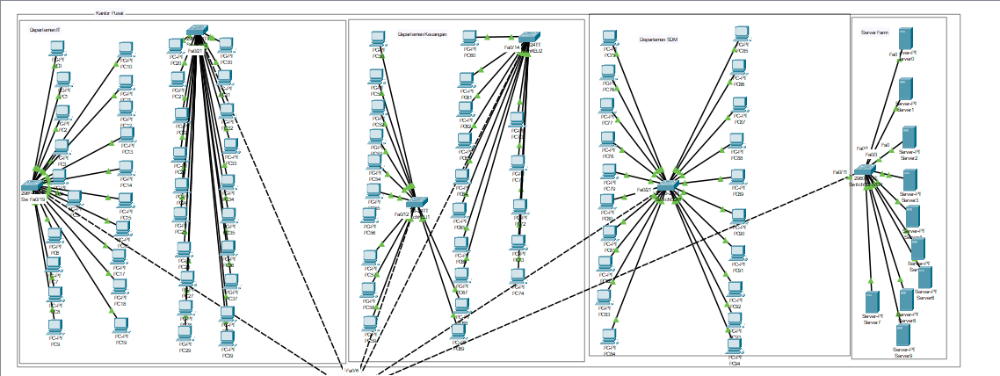
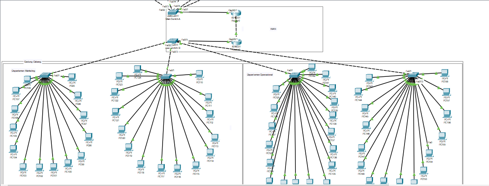
**Penjelasan:**
Topologi ini menunjukkan implementasi jaringan berbasis VLAN (Virtual Local Area Network) di dua lokasi fisik: **Gedung A** dan **Gedung B**, yang terhubung melalui **Core Router**. Konfigurasi ini bertujuan untuk membagi lalu lintas jaringan menjadi beberapa segmen logis (VLAN) berdasarkan departemen atau fungsionalitas tertentu, sambil memastikan komunikasi yang efisien antar-VLAN dan antar-lokasi.

---

### **Komponen Utama dalam Topologi**

#### **A. Core Router**
- **Fungsi**: Core Router adalah inti dari topologi ini, bertindak sebagai pusat penghubung utama antara kedua gedung dan menyediakan routing antar-VLAN serta koneksi ke Internet.
- **Konfigurasi VLAN**:
  - Core Router memiliki sub-interface untuk masing-masing VLAN.
  - Sub-interface ini digunakan untuk routing antar-VLAN dan mengizinkan komunikasi antar-departemen.
- **Koneksi Trunk**:
  - Core Router terhubung ke **Main Switch A** dan **Main Switch B** menggunakan trunk port (`GigabitEthernet0/0/1`) untuk mendukung semua VLAN yang diperlukan.

#### **B. Main Switch A (Gedung A)**
- **Fungsi**: Main Switch A adalah switch layer 3 yang mengelola semua VLAN di Gedung A.
- **Port Konfigurasi**:
  - Port akses (access ports) dikonfigurasi untuk setiap VLAN sesuai dengan departemen:
    - **VLAN 10**: Departemen IT
    - **VLAN 20**: Departemen Keuangan
    - **VLAN 30**: Departemen SDM
    - **VLAN 40**: Server Farm
  - Port trunk (`FastEthernet0/1`) terhubung ke Core Router untuk mengizinkan semua VLAN melewati koneksi tersebut.
- **VLAN Configuration**:
  - Setiap VLAN telah dibuat dan diberi nama sesuai dengan departemen:
    - VLAN 10: `VLAN_IT`
    - VLAN 20: `VLAN_KEU`
    - VLAN 30: `VLAN_SDM`
    - VLAN 40: `VLAN_SERVER`

#### **C. Main Switch B (Gedung B)**
- **Fungsi**: Main Switch B adalah switch layer 3 yang mengelola semua VLAN di Gedung B.
- **Port Konfigurasi**:
  - Port akses (access ports) dikonfigurasi untuk setiap VLAN sesuai dengan departemen:
    - **VLAN 50**: Departemen Marketing
    - **VLAN 60**: Departemen Operasional
  - Port trunk (`FastEthernet0/1`) terhubung ke Core Router untuk mengizinkan semua VLAN melewati koneksi tersebut.
- **VLAN Configuration**:
  - Setiap VLAN telah dibuat dan diberi nama sesuai dengan departemen:
    - VLAN 50: `VLAN_MKT`
    - VLAN 60: `VLAN_OPS`

#### **D. Access Switches**
- **Fungsi**: Access Switches digunakan untuk menyediakan koneksi langsung ke perangkat end-user seperti PC di setiap departemen.
- **Port Konfigurasi**:
  - Semua port access switch dikonfigurasi sebagai **access port** untuk VLAN yang relevan.
  - Misalnya:
    - Departemen IT: Semua port di konfigurasi untuk VLAN 10.
    - Departemen Keuangan: Semua port di konfigurasi untuk VLAN 20.
    - Departemen SDM: Semua port di konfigurasi untuk VLAN 30.
    - Departemen Marketing: Semua port di konfigurasi untuk VLAN 50.
    - Departemen Operasional: Semua port di konfigurasi untuk VLAN 60.

#### **E. Server Farm**
- **Fungsi**: Server Farm berisi server-server penting seperti DHCP/DNS Server, Database Server, dan lainnya.
- **Konfigurasi VLAN**:
  - Semua server dalam Server Farm terhubung ke Main Switch A melalui VLAN 40 (`VLAN_SERVER`).

#### **F. Koneksi Antara Gedung**
- **Trunk Connection**:
  - Koneksi antara **Main Switch A** dan **Core Router**, serta **Main Switch B** dan **Core Router**, menggunakan **trunk port** untuk mendukung semua VLAN yang diperlukan.
  - Ini memungkinkan komunikasi antar-VLAN dan antar-gedung tanpa batasan.

#### **G. NAT (Network Address Translation)**
- **Fungsi**: Core Router juga dilengkapi dengan NAT untuk mengatur koneksi ke Internet.
- **Konfigurasi**:
  - Interface eksternal Core Router (`GigabitEthernet0/0/0`) diatur sebagai NAT outside.
  - Interface internal Core Router (`GigabitEthernet0/0/1`) diatur sebagai NAT inside.
  - Access List (ACL) digunakan untuk mengatur alamat IP yang dapat melakukan NAT.

---

### **3. Implementasi VLAN**
#### **A. Pembagian VLAN Berdasarkan Departemen**
- **Gedung A**:
  - **VLAN 10**: Departemen IT
  - **VLAN 20**: Departemen Keuangan
  - **VLAN 30**: Departemen SDM
  - **VLAN 40**: Server Farm
- **Gedung B**:
  - **VLAN 50**: Departemen Marketing
  - **VLAN 60**: Departemen Operasional

#### **B. Native VLAN**
- **Native VLAN** adalah VLAN default yang digunakan oleh lalu lintas untagged (untagged traffic). Untuk menghindari konflik native VLAN, ada beberapa hal yang harus di pastikan, yaitu:
  - Port trunk di kedua sisi koneksi memiliki **native VLAN yang sama**.
  - Contoh: Jika port trunk di Main Switch A menggunakan native VLAN 10, maka port trunk di  Switch departemen IT yang terhubung harus juga menggunakan native VLAN 10.

#### **C. Routing Antar-VLAN**
- **Sub-Interface pada Core Router**:
  - Core Router menggunakan sub-interface untuk mendukung routing antar-VLAN.
  - Setiap sub-interface diatur untuk VLAN tertentu, misalnya:
    - `GigabitEthernet0/0/1.10`: VLAN 10
    - `GigabitEthernet0/0/1.20`: VLAN 20
    - `GigabitEthernet0/0/1.30`: VLAN 30
    - `GigabitEthernet0/0/1.40`: VLAN 40
    - `GigabitEthernet0/0/1.50`: VLAN 50
    - `GigabitEthernet0/0/1.60`: VLAN 60

#### **D. Spanning Tree Protocol (STP)**
- STP digunakan untuk menghindari loop dalam jaringan Ethernet.
- **Port FastEthernet0/1** di Main Switch A dan Main Switch B diaktifkan sebagai trunk port untuk mendukung semua VLAN yang diperlukan.

---

## 3.  Dokumentasi Konfigurasi CLI

###  Router Configuration


#### Router 1
```bash
Router(config)#interface GigabitEthernet0/0/1
Router(config-if)#
Router(config-if)#exit
Router(config)#interface GigabitEthernet0/0/0
Router(config-if)#
Router(config-if)#exit
Router(config)#interface GigabitEthernet0/0/2
Router(config-if)#
Router(config-if)#exit
Router(config)#interface GigabitEthernet0/0/1
Router(config-if)#encapsulation dot1Q 10
Router(config-if)#exit
Router(config)#interface GigabitEthernet0/0/1.10
Router(config-subif)#encapsulation dot1Q 10
Router(config-subif)#ip address 192.168.10.1 255.255.255.0
Router(config-subif)#no shutdown
Router(config-subif)#exit
Router(config)#exit

Router#write memory
Building configuration...
[OK]

Router#configure terminal
Enter configuration commands, one per line.  End with CNTL/Z.
Router(config)#interface GigabitEthernet0/0/0
Router(config-if)#ip address 192.168.99.2 255.255.255.0
Router(config-if)#no shutdown
Router(config-if)#exit
Router(config)#interface GigabitEthernet0/0/1.10
Router(config-subif)#encapsulation dot1Q 10
Router(config-subif)#ip address 192.168.10.1 255.255.255.0
Router(config-subif)#no shutdown
Router(config-subif)#exit
Router(config)#interface GigabitEthernet0/0/1.20
Router(config-subif)#encapsulation dot1Q 20
Router(config-subif)#ip address 192.168.20.1 255.255.255.0
Router(config-subif)#no shutdown
Router(config-subif)#exit
Router(config)#interface GigabitEthernet0/0/1.30
Router(config-subif)#encapsulation dot1Q 30
Router(config-subif)#ip address 192.168.30.1 255.255.255.0
Router(config-subif)#no shutdown
Router(config-subif)#exit
Router(config)#interface GigabitEthernet0/0/1.40
Router(config-subif)#encapsulation dot1Q 40
Router(config-subif)#ip address 192.168.40.1 255.255.255.0
Router(config-subif)#no shutdown
Router(config-subif)#exit
Router(config)#interface GigabitEthernet0/0/1.50
Router(config-subif)#encapsulation dot1Q 50
Router(config-subif)#ip address 192.168.50.1 255.255.255.0
Router(config-subif)#no shutdown
Router(config-subif)#exit
Router(config)#interface GigabitEthernet0/0/1.60
Router(config-subif)#encapsulation dot1Q 60
Router(config-subif)#ip address 192.168.60.1 255.255.255.0
Router(config-subif)#no shutdown
Router(config-subif)#exit
Router(config)#router ospf 1
Router(config-router)#network 192.168.99.0 0.0.0.255 area 0
Router(config-router)#network 192.168.10.0 0.0.0.255 area 1
Router(config-router)#network 192.168.20.0 0.0.0.255 area 1
Router(config-router)#network 192.168.30.0 0.0.0.255 area 1
Router(config-router)#network 192.168.40.0 0.0.0.255 area 1
Router(config-router)#network 192.168.50.0 0.0.0.255 area 2
Router(config-router)#network 192.168.60.0 0.0.0.255 area 2
Router(config-router)#exit
Router(config)#exit

Router#write memory
Building configuration...
[OK]

Router#show ip interface brief
Interface               IP-Address      OK? Method Status                Protocol 
GigabitEthernet0/0/0    192.168.99.2    YES manual up                    up 
GigabitEthernet0/0/0.10 unassigned      YES unset  up                    up 
GigabitEthernet0/0/1    unassigned      YES unset  up                    up 
GigabitEthernet0/0/1.10 192.168.10.1
```
---
#### Router 0

```bash
Router>enable
Router#configure terminal
Enter configuration commands, one per line.  End with CNTL/Z.
Router(config)#interface GigabitEthernet0/0/0
Router(config-if)#ip address 203.0.113.1 255.255.255.0
Router(config-if)#no shutdown

Router(config-if)#interface GigabitEthernet0/0/1
Router(config-if)#ip address 192.168.99.1 255.255.255.0
Router(config-if)#no shutdown

Router(config-if)#router ospf 1
Router(config-router)#network 192.168.99.0 0.0.0.255 area 0
Router(config-router)#network 203.0.113.0 0.0.0.255 area 0
Router(config-router)#exit
Router(config)#access-list 1 permit 192.168.0.0 0.0.255.255
Router(config)#ip nat inside source list 1 interface GigabitEthernet0/0/0 overload

Router(config)#interface GigabitEthernet0/0/1
Router(config-if)#ip nat inside
Router(config-if)#interface GigabitEthernet0/0/0
Router(config-if)#ip nat outside
Router(config-if)#exit
Router(config)#exit

Router#write memory
Building configuration...
[OK]

```
---
### Switch Configuration

#### Main Switch A

```bash
Switch>enable
Switch#show interfaces trunk

Switch#show vlan

VLAN Name                             Status    Ports
---- -------------------------------- --------- -------------------------------
1    default                          active    Fa0/3, Fa0/4, Fa0/5, Fa0/6
                                                Fa0/7, Fa0/8, Fa0/9, Fa0/10
                                                Fa0/11, Fa0/12, Fa0/13, Fa0/14
                                                Fa0/15, Fa0/16, Fa0/17, Fa0/18
                                                Fa0/19, Fa0/20, Fa0/21, Fa0/22
                                                Fa0/23, Fa0/24, Gig0/1, Gig0/2
10   VLAN_IT                          active    Fa0/2
20   VLAN_KEU                         active    
30   VLAN_SDM                         active    
40   VLAN_SERVER                      active    
99   VLAN_MGHT                        active    
1002 fddi-default                     active    
1003 token-ring-default               active    
1004 fddinet-default                  active    
1005 trnet-default                    active    

VLAN Type  SAID       MTU   Parent RingNo BridgeNo Stp  BrdgMode Trans1 Trans2
---- ----- ---------- ----- ------ ------ -------- ---- -------- ------ ------

Switch#show interfaces status
Port      Name               Status       Vlan       Duplex  Speed Type
Fa0/1                        connected    trunk      auto    auto  10/100BaseTX
Fa0/2                        connected    10         auto    auto  10/100BaseTX
Fa0/3                        connected    1          auto    auto  10/100BaseTX
Fa0/4                        notconnect   1          auto    auto  10/100BaseTX
Fa0/5                        connected    1          auto    auto  10/100BaseTX
Fa0/6                        connected    1          auto    auto  10/100BaseTX
Fa0/7                        connected    1          auto    auto  10/100BaseTX
Fa0/8                        connected    1          auto    auto  10/100BaseTX
Fa0/9                        notconnect   1          auto    auto  10/100BaseTX
Fa0/10                       notconnect   1          auto    auto  10/100BaseTX
Fa0/11                       notconnect   1          auto    auto  10/100BaseTX
Fa0/12                       notconnect   1          auto    auto  10/100BaseTX
Fa0/13                       notconnect   1          auto    auto  10/100BaseTX
Fa0/14                       notconnect   1          auto    auto  10/100BaseTX
Fa0/15                       notconnect   1          auto    auto  10/100BaseTX
Fa0/16                       notconnect   1          auto    auto  10/100BaseTX
Fa0/17                       notconnect   1          auto    auto  10/100BaseTX
Fa0/18                       notconnect   1          auto    auto  10/100BaseTX
Fa0/19                       notconnect   1          auto    auto  10/100BaseTX
Fa0/20                       notconnect   1          auto    auto  10/100BaseTX
Fa0/21                       notconnect   1          auto    auto  10/100BaseTX

Switch#configure terminal
Enter configuration commands, one per line.  End with CNTL/Z.
Switch(config)#interface FastEthernet0/1
Switch(config-if)#switchport mode trunk
Switch(config-if)#switchport trunk allowed vlan 10,20,30,40,99
Switch(config-if)#exit
Switch(config)#exit
Switch#
%SYS-5-CONFIG_I: Configured from console by console

Switch#configure terminal
Enter configuration commands, one per line.  End with CNTL/Z.
Switch(config)#interface FastEthernet0/2
Switch(config-if)#switchport mode trunk
Switch(config-if)#switchport trunk allowed vlan 10
Switch(config-if)#exit
Switch(config)#exit
Switch#

Switch#configure terminal
Enter configuration commands, one per line.  End with CNTL/Z.
Switch(config)#interface FastEthernet0/3
Switch(config-if)#switchport mode trunk
Switch(config-if)#switchport trunk allowed vlan 10
Switch(config-if)#exit
Switch(config)#exit
Switch#

Switch#configure terminal
Enter configuration commands, one per line.  End with CNTL/Z.
Switch(config)#interface FastEthernet0/5
Switch(config-if)#switchport mode trunk
Switch(config-if)#switchport trunk allowed vlan 20
Switch(config-if)#exit
Switch(config)#exit
Switch#

Switch#configure terminal
Enter configuration commands, one per line.  End with CNTL/Z.
Switch(config)#interface FastEthernet0/6
Switch(config-if)#switchport mode trunk
Switch(config-if)#switchport trunk allowed vlan 20
Switch(config-if)#exit
Switch(config)#exit
Switch#

Switch#configure terminal
Enter configuration commands, one per line.  End with CNTL/Z.
Switch(config)#interface FastEthernet0/7
Switch(config-if)#switchport mode trunk
Switch(config-if)#switchport trunk allowed vlan 30
Switch(config-if)#exit
Switch(config)#exit
Switch#

Switch#configure terminal
Enter configuration commands, one per line.  End with CNTL/Z.
Switch(config)#interface FastEthernet0/8
Switch(config-if)#switchport mode trunk
Switch(config-if)#switchport trunk allowed vlan 40
Switch(config-if)#exit
Switch(config)#exit
Switch#
%SYS-5-CONFIG_I: Configured from console by console

Switch#show vlan brief

VLAN Name                             Status    Ports
---- -------------------------------- --------- -------------------------------
1    default                          active    Fa0/3, Fa0/4, Fa0/5, Fa0/6
                                                Fa0/7, Fa0/8, Fa0/9, Fa0/10
                                                Fa0/11, Fa0/12, Fa0/13, Fa0/14
                                                Fa0/15, Fa0/16, Fa0/17, Fa0/18
                                                Fa0/19, Fa0/20, Fa0/21, Fa0/22
                                                Fa0/23, Fa0/24, Gig0/1, Gig0/2
10   VLAN_IT                          active    Fa0/2
20   VLAN_KEU                         active    
30   VLAN_SDM                         active    
40   VLAN_SERVER                      active    
99   VLAN_MGHT                        active    
1002 fddi-default                     active    
1003 token-ring-default               active    
1004 fddinet-default                  active    
1005 trnet-default                    active    

```
---
#### Main Switch B

```bash
Switch>enable
Switch#configure terminal
Enter configuration commands, one per line.  End with CNTL/Z.
Switch(config)#vlan 50
Switch(config-vlan)#name VLAN_MKT
Switch(config-vlan)#exit
Switch(config)#vlan 60
Switch(config-vlan)#name VLAN_OPS
Switch(config-vlan)#vlan 99
Switch(config-vlan)#name VLAN_MGHT
Switch(config-vlan)#exit
Switch(config)#interface GigabitEthernet0/1
Switch(config-if)#switchport mode trunk
Switch(config-if)#switchport trunk allowed vlan 50,60,99
Switch(config-if)#exit
%SYS-5-CONFIG_I: Configured from console by console
Switch(config)#interface FastEthernet0/2
Switch(config-if)#switchport mode trunk
Switch(config-if)#switchport trunk allowed vlan 50
Switch(config-if)#exit
Switch(config)#exit
Switch#

Switch(config)#interface FastEthernet0/3
Switch(config-if)#switchport mode trunk
Switch(config-if)#switchport trunk allowed vlan 50
Switch(config-if)#exit
Switch(config)#exit
Switch#

Switch(config)#interface FastEthernet0/4
Switch(config-if)#switchport mode trunk
Switch(config-if)#switchport trunk allowed vlan 60
Switch(config-if)#exit
Switch(config)#exit
Switch#

Switch(config)#interface FastEthernet0/5
Switch(config-if)#switchport mode trunk
Switch(config-if)#switchport trunk allowed vlan 60
Switch(config-if)#exit
Switch(config)#exit
Switch#exit
Switch>show vlan brief
VLAN Name                             Status    Ports
---- -------------------------------- --------- -------------------------------
1    default                          active    Fa0/6, Fa0/7, Fa0/8, Fa0/9
                                                Fa0/10, Fa0/11, Fa0/12, Fa0/13
                                                Fa0/14, Fa0/15, Fa0/16, Fa0/17
                                                Fa0/18, Fa0/19, Fa0/20, Fa0/21
                                                Fa0/22, Fa0/23, Fa0/24, Gig0/1
                                                Gig0/2
50   VLAN_MKT                         active    Fa0/2, Fa0/3
60   VLAN_OPS                         active    Fa0/4, Fa0/5
99   VLAN_MGHT                        active    
1002 fddi-default                     active    
1003 token-ring-default               active    
1004 fddinet-default                  active    
1005 trnet-default                    active    
Switch>

Switch#write memory
Building configuration...
[OK]
```
#### switch it 1
```bash
Switch>enable
Switch#configure terminal

Switch(config)#vlan 10
Switch(config-vlan)#name VLAN_IT
Switch(config-vlan)#exit

Switch(config)#interface FastEthernet0/19
Switch(config-if)#switchport mode trunk
Switch(config-if)#switchport trunk allowed vlan 10
Switch(config-if)#switchport trunk native vlan 10
Switch(config-if)#exit

Switch(config)#interface range FastEthernet0/1 - 18
Switch(config-if-range)#switchport mode access
Switch(config-if-range)#switchport access vlan 10
Switch(config-if-range)#exit

Switch(config)#exit
Switch#write memory
Building configuration...
[OK]

Switch#show interfaces status
Port      Name               Status       Vlan       Duplex  Speed Type
Fa0/1                        connected    10         auto    auto  10/100BaseTX
Fa0/2                        connected    10         auto    auto  10/100BaseTX
Fa0/3                        connected    10         auto    auto  10/100BaseTX
Fa0/4                        connected    10         auto    auto  10/100BaseTX
Fa0/5                        connected    10         auto    auto  10/100BaseTX
Fa0/6                        connected    10         auto    auto  10/100BaseTX
Fa0/7                        connected    10         auto    auto  10/100BaseTX
Fa0/8                        connected    10         auto    auto  10/100BaseTX
Fa0/9                        connected    10         auto    auto  10/100BaseTX
Fa0/10                       connected    10         auto    auto  10/100BaseTX
Fa0/11                       connected    10         auto    auto  10/100BaseTX
Fa0/12                       connected    10         auto    auto  10/100BaseTX
Fa0/13                       connected    10         auto    auto  10/100BaseTX
Fa0/14                       connected    10         auto    auto  10/100BaseTX
Fa0/15                       connected    10         auto    auto  10/100BaseTX
Fa0/16                       connected    10         auto    auto  10/100BaseTX
Fa0/17                       connected    10         auto    auto  10/100BaseTX
Fa0/18                       connected    10         auto    auto  10/100BaseTX
Fa0/19                       connected    trunk      auto    auto  10/100BaseTX
Fa0/20                       notconnect   1          auto    auto  10/100BaseTX
Fa0/21                       notconnect   1          auto    auto  10/100BaseTX

Switch#show interfaces trunk
Port        Mode         Encapsulation  Status        Native vlan
Fa0/19      on           802.1q         trunking      10

Port        Vlans allowed on trunk
Fa0/19      10

Port        Vlans allowed and active in management domain
Fa0/19      10

Port        Vlans in spanning tree forwarding state and not pruned
Fa0/19      10
```

#### switch it 2
```bash
Switch>enable
Switch#configure terminal

Switch(config)#vlan 10
Switch(config-vlan)#name VLAN_IT
Switch(config-vlan)#exit

Switch(config)#interface FastEthernet0/21
Switch(config-if)#switchport mode trunk
Switch(config-if)#switchport trunk allowed vlan 10
Switch(config-if)#switchport trunk native vlan 10
Switch(config-if)#exit

Switch(config)#interface range FastEthernet0/1 - 20
Switch(config-if-range)#switchport mode access
Switch(config-if-range)#switchport access vlan 10
Switch(config-if-range)#exit

Switch(config)#exit
Switch#write memory
Building configuration...
[OK]

Switch#show interfaces status
Port      Name               Status       Vlan       Duplex  Speed Type
Fa0/1                        connected    10         auto    auto  10/100BaseTX
Fa0/2                        connected    10         auto    auto  10/100BaseTX
Fa0/3                        connected    10         auto    auto  10/100BaseTX
Fa0/4                        connected    10         auto    auto  10/100BaseTX
Fa0/5                        connected    10         auto    auto  10/100BaseTX
Fa0/6                        connected    10         auto    auto  10/100BaseTX
Fa0/7                        connected    10         auto    auto  10/100BaseTX
Fa0/8                        connected    10         auto    auto  10/100BaseTX
Fa0/9                        connected    10         auto    auto  10/100BaseTX
Fa0/10                       connected    10         auto    auto  10/100BaseTX
Fa0/11                       connected    10         auto    auto  10/100BaseTX
Fa0/12                       connected    10         auto    auto  10/100BaseTX
Fa0/13                       connected    10         auto    auto  10/100BaseTX
Fa0/14                       connected    10         auto    auto  10/100BaseTX
Fa0/15                       connected    10         auto    auto  10/100BaseTX
Fa0/16                       connected    10         auto    auto  10/100BaseTX
Fa0/17                       connected    10         auto    auto  10/100BaseTX
Fa0/18                       connected    10         auto    auto  10/100BaseTX
Fa0/19                       connected    10         auto    auto  10/100BaseTX
Fa0/20                       connected    10         auto    auto  10/100BaseTX
Fa0/21                       connected    trunk      auto    auto  10/100BaseTX
```

#### switch keu 1
```bash
Switch>enable
Switch#configure terminal
Enter configuration commands, one per line.  End with CNTL/Z.
Switch(config)#vlan 20
Switch(config-vlan)#name VLAN_KEU
Switch(config-vlan)#exit
Switch(config)#interface FastEthernet0/12
Switch(config-if)#switchport mode trunk
Switch(config-if)#switchport trunk allowed vlan 20
Switch(config-if)#switchport trunk native vlan 20
Switch(config-if)#exit
Switch(config)#interface range FastEthernet0/1 - 11
Switch(config-if-range)#switchport mode access
Switch(config-if-range)#switchport access vlan 20
Switch(config-if-range)#exit
Switch(config)#exit
Switch#
%SYS-5-CONFIG_I: Configured from console by console
Switch#write memory
Building configuration...
[OK]
```

#### switch keu 2

```bash
Switch>enable
Switch#configure terminal
Enter configuration commands, one per line.  End with CNTL/Z.
Switch(config)#vlan 20
Switch(config-vlan)#name VLAN_KEU
Switch(config-vlan)#exit
Switch(config)#interface FastEthernet0/14
Switch(config-if)#switchport mode trunk
Switch(config-if)#switchport trunk allowed vlan 20
Switch(config-if)#switchport trunk native vlan 20
Switch(config-if)#exit
Switch(config)#interface range FastEthernet0/1 - 13
Switch(config-if-range)#switchport mode access
Switch(config-if-range)#switchport access vlan 20
Switch(config-if-range)#exit
Switch(config)#exit
Switch#
%SYS-5-CONFIG_I: Configured from console by console
Switch#write memory
Building configuration...
[OK]
```

#### switch SDM

```bash
Switch>enable
Switch#configure terminal
Enter configuration commands, one per line.  End with CNTL/Z.
Switch(config)#vlan 30
Switch(config-vlan)#name VLAN_SDM
Switch(config-vlan)#exit
Switch(config)#interface FastEthernet0/21
Switch(config-if)#switchport mode trunk
Switch(config-if)#switchport trunk allowed vlan 30
Switch(config-if)#switchport trunk native vlan 30
Switch(config-if)#exit
Switch(config)#interface range FastEthernet0/1 - 20
Switch(config-if-range)#switchport mode access
Switch(config-if-range)#switchport access vlan 30
Switch(config-if-range)#exit
Switch(config)#exit
Switch#
%SYS-5-CONFIG_I: Configured from console by console
Switch#write memory
Building configuration...
[OK]
Switch#show interface status
Port      Name               Status       Vlan       Duplex  Speed Type
Fa0/1                        connected    30         auto    auto  10/100BaseTX
Fa0/2                        connected    30         auto    auto  10/100BaseTX
Fa0/3                        connected    30         auto    auto  10/100BaseTX
Fa0/4                        connected    30         auto    auto  10/100BaseTX
Fa0/5                        connected    30         auto    auto  10/100BaseTX
Fa0/6                        connected    30         auto    auto  10/100BaseTX
Fa0/7                        connected    30         auto    auto  10/100BaseTX
Fa0/8                        connected    30         auto    auto  10/100BaseTX
Fa0/9                        connected    30         auto    auto  10/100BaseTX
Fa0/10                       connected    30         auto    auto  10/100BaseTX
Fa0/11                       connected    30         auto    auto  10/100BaseTX
Fa0/12                       connected    30         auto    auto  10/100BaseTX
Fa0/13                       connected    30         auto    auto  10/100BaseTX
Fa0/14                       connected    30         auto    auto  10/100BaseTX
Fa0/15                       connected    30         auto    auto  10/100BaseTX
Fa0/16                       connected    30         auto    auto  10/100BaseTX
Fa0/17                       connected    30         auto    auto  10/100BaseTX
Fa0/18                       connected    30         auto    auto  10/100BaseTX
Fa0/19                       connected    30         auto    auto  10/100BaseTX
Fa0/20                       connected    30         auto    auto  10/100BaseTX
Fa0/21                       connected    trunk      auto    auto  10/100BaseTX
```

#### switch server

```bash
Switch>enable
Switch#configure terminal
Enter configuration commands, one per line.  End with CNTL/Z.
Switch(config)#vlan 40
Switch(config-vlan)#name VLAN_SERVER
Switch(config-vlan)#exit
Switch(config)#interface FastEthernet0/11
Switch(config-if)#switchport mode trunk
Switch(config-if)#
%LINEPROTO-5-UPDOWN: Line protocol on Interface FastEthernet0/11, changed state to down
%LINEPROTO-5-UPDOWN: Line protocol on Interface FastEthernet0/11, changed state to up
Switch(config-if)#switchport trunk allowed vlan 40
Switch(config-if)#switchport trunk native vlan 40
Switch(config-if)#exit
Switch(config)#interface range FastEthernet0/1 - 10
Switch(config-if-range)#switchport mode access
Switch(config-if-range)#switchport access vlan 40
Switch(config-if-range)#exit
Switch(config)#exit
Switch#
%SYS-5-CONFIG_I: Configured from console by console
Switch#write memory
Building configuration...
[OK]
```

#### switch mkt1
```bash
Switch>enable
Switch#configure terminal
Enter configuration commands, one per line.  End with CNTL/Z.
Switch(config)#vlan 50
Switch(config-vlan)#name VLAN_MKT
Switch(config-vlan)#exit
Switch(config)#interface FastEthernet0/1
Switch(config-if)#switchport mode trunk
Switch(config-if)#
%LINEPROTO-5-UPDOWN: Line protocol on Interface FastEthernet0/1, changed state to down
%LINEPROTO-5-UPDOWN: Line protocol on Interface FastEthernet0/1, changed state to up
Switch(config-if)#switchport trunk allowed vlan 50
Switch(config-if)#switchport trunk native vlan 50
Switch(config-if)#exit
Switch(config)#interface range FastEthernet0/2 - 15
Switch(config-if-range)#switchport mode access
Switch(config-if-range)#switchport access vlan 50
Switch(config-if-range)#exit
Switch(config)#exit
Switch#
%SYS-5-CONFIG_I: Configured from console by console
Switch#write memory
Building configuration...
[OK]
```

#### switch mkt2
```bash
Switch>enable
Switch#configure terminal
Enter configuration commands, one per line.  End with CNTL/Z.
Switch(config)#vlan 50
Switch(config-vlan)#name VLAN_MKT
Switch(config-vlan)#exit
Switch(config)#interface FastEthernet0/1
Switch(config-if)#switchport mode trunk
Switch(config-if)#
%LINEPROTO-5-UPDOWN: Line protocol on Interface FastEthernet0/1, changed state to down
%LINEPROTO-5-UPDOWN: Line protocol on Interface FastEthernet0/1, changed state to up
Switch(config-if)#switchport trunk allowed vlan 50
Switch(config-if)#switchport trunk native vlan 50
Switch(config-if)#exit
Switch(config)#interface range FastEthernet0/2 - 16
Switch(config-if-range)#switchport mode access
Switch(config-if-range)#switchport access vlan 50
Switch(config-if-range)#exit
Switch(config)#exit
Switch#
%SYS-5-CONFIG_I: Configured from console by console
Switch#write memory
Building configuration...
[OK]
```

#### switch ops1
```bash
Switch>enable
Switch#configure terminal
Enter configuration commands, one per line.  End with CNTL/Z.
Switch(config)#vlan 60
Switch(config-vlan)#name VLAN_OPS
Switch(config-vlan)#exit
Switch(config)#interface FastEthernet0/1
Switch(config-if)#switchport mode trunk
Switch(config-if)#
%LINEPROTO-5-UPDOWN: Line protocol on Interface FastEthernet0/1, changed state to down
%LINEPROTO-5-UPDOWN: Line protocol on Interface FastEthernet0/1, changed state to up
Switch(config-if)#switchport trunk allowed vlan 60
Switch(config-if)#switchport trunk native vlan 60
Switch(config-if)#exit
Switch(config)#interface range FastEthernet0/2 - 19
Switch(config-if-range)#switchport mode access
Switch(config-if-range)#switchport access vlan 60
Switch(config-if-range)#exit
Switch(config)#exit
Switch#
%SYS-5-CONFIG_I: Configured from console by console
Switch#write memory
Building configuration...
[OK]
```
#### switch ops2
```bash
Switch>enable
Switch#configure terminal
Enter configuration commands, one per line.  End with CNTL/Z.
Switch(config)#vlan 60
Switch(config-vlan)#name VLAN_OPS
Switch(config-vlan)#exit
Switch(config)#interface FastEthernet0/1
Switch(config-if)#switchport mode trunk
Switch(config-if)#
%LINEPROTO-5-UPDOWN: Line protocol on Interface FastEthernet0/1, changed state to down
%LINEPROTO-5-UPDOWN: Line protocol on Interface FastEthernet0/1, changed state to up
Switch(config-if)#switchport trunk allowed vlan 60
Switch(config-if)#switchport trunk native vlan 60
Switch(config-if)#exit
Switch(config)#interface range FastEthernet0/2 - 17
Switch(config-if-range)#switchport mode access
Switch(config-if-range)#switchport access vlan 60
Switch(config-if-range)#exit
Switch(config)#exit
Switch#
%SYS-5-CONFIG_I: Configured from console by console
Switch#write memory
Building configuration...
[OK]
```


## 4. Hasil Pengujian Konektivitas
### **1. Pengujian Konfigurasi VLAN**
### **Tujuan:**
Memastikan semua VLAN telah dikonfigurasi dengan benar dan port terhubung ke VLAN yang sesuai.

#### **Langkah 1.1: Verifikasi VLAN**
- **Deskripsi:** Periksa daftar VLAN yang ada di switch.
- **Perintah:**
  ```bash
  show vlan brief
  ```
- **Hasil yang Diharapkan:**
  - Semua VLAN yang dikonfigurasi muncul dalam daftar.
  - Port yang ditetapkan untuk setiap VLAN sesuai dengan desain.
- **Hasil Aktual:**
  Main switch A
  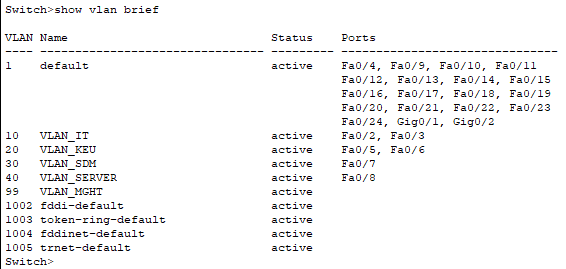

  hasil perintah show vlan brief di Switch pertama, yang menunjukkan bahwa telah dibuat beberapa VLAN seperti VLAN_IT (VLAN 10), VLAN_KEU (20), VLAN_SDM (30), dan VLAN_SERVER (40), serta VLAN_MGHT (99) yang kemungkinan digunakan sebagai VLAN manajemen. Setiap VLAN memiliki port tertentu yang ditugaskan, contohnya VLAN_IT terhubung ke port Fa0/2 dan Fa0/3, sedangkan VLAN default (1) masih memuat banyak port yang belum dipindahkan.

  Main switch B
  

  show vlan brief di Switch kedua, di mana VLAN yang dibuat antara lain VLAN_MKT (50), VLAN_OPS (60), dan VLAN_MGHT (99). Port-port seperti Fa0/2 dan Fa0/3 masuk ke VLAN_MKT, sedangkan Fa0/4 dan Fa0/5 masuk ke VLAN_QBS. Sisanya masih berada di VLAN default (1). Ini menunjukkan bahwa konfigurasi VLAN telah disesuaikan sesuai kebutuhan departemen masing-masing.

  untuk swtich per departemennya memiliki hasil yang hampir sama, hanya saja VLAN yang berbeda dan port yang berbeda, berikut hasilnya:

  #### Switch Departemen IT

  Switch IT1
  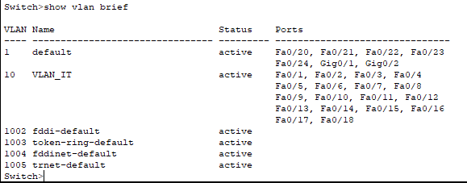

  Switch IT2
  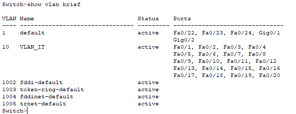

  #### Switch Departemen Keuangan

  Switch KEU1
  

  Switch KEU2
  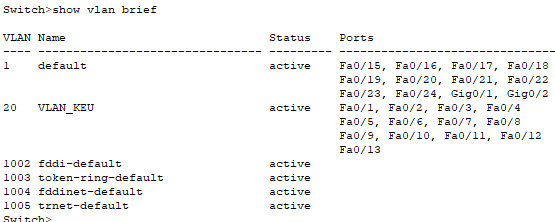

  #### Switch Departemen SDM
  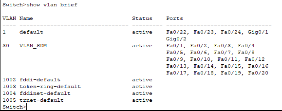

  #### Switch Server Farm
  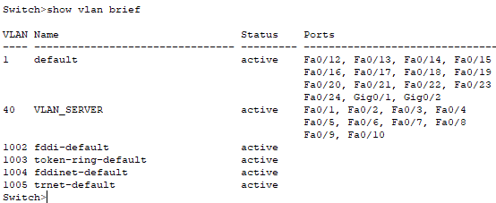

  #### Switch Departemen Marketing
  Switch MKT1

  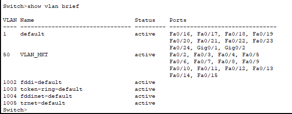

  Switch MKT2

  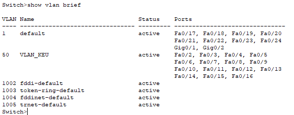

  #### Switch Departemen Operasional
  Switch OPS1

  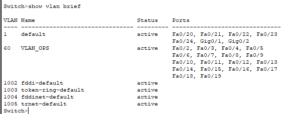

  Switch OPS2

  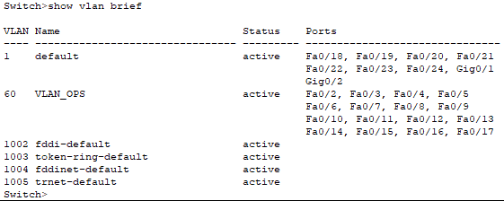


#### **Langkah 1.2: Verifikasi Status Port**
- **Deskripsi:** Periksa status port untuk memastikan port berada dalam mode dan VLAN yang benar.
- **Perintah:**
  ```bash
  show interfaces status
  ```
- **Hasil yang Diharapkan:**
  - Port trunk memiliki status `trunk` dan mengizinkan VLAN yang sesuai.
  - Port access memiliki status `connected` dan terhubung ke VLAN yang benar.
- **Hasil Aktual:**

  Main Switch A
  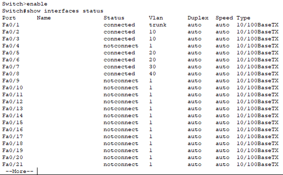

  perintah show interfaces status di Switch pertama. Terlihat bahwa Fa0/1 sudah dikonfigurasi sebagai trunk, artinya digunakan untuk menghubungkan antar switch dan membawa semua VLAN. Port lainnya seperti Fa0/2 sampai Fa0/8 berada dalam VLAN-VLAN yang telah dibuat, seperti Fa0/2 dan Fa0/3 di VLAN 10, Fa0/5 dan Fa0/6 di VLAN 20, dll. Status connected menunjukkan perangkat terhubung aktif, sedangkan notconnect berarti belum ada perangkat yang terhubung.

  Main Switch B
  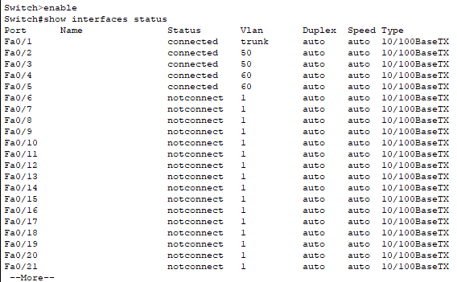

  Sama seperti switch pertama, port Fa0/1 berstatus trunk, sedangkan Fa0/2 dan Fa0/3 terhubung ke VLAN 50 (VLAN_MKT), dan Fa0/4 dan Fa0/5 ke VLAN 60 (VLAN_QBS). Port lain masih belum terkoneksi dan berada di VLAN default. Ini mendukung bahwa pengelompokan VLAN antar kedua switch telah dibuat dan siap digunakan.

  
  #### Switch Departemen IT
  Switch IT 1

  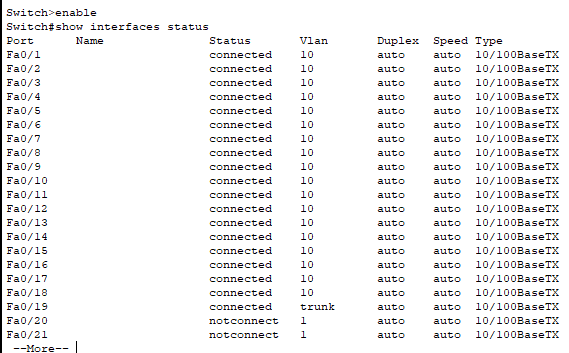

  Switch IT 2

  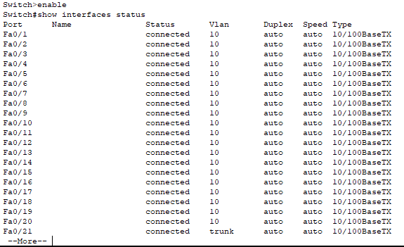

  #### Switch Departemen Keuangan
  Switch KEU1

  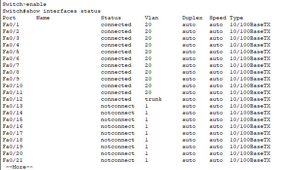

  Switch KEU2

  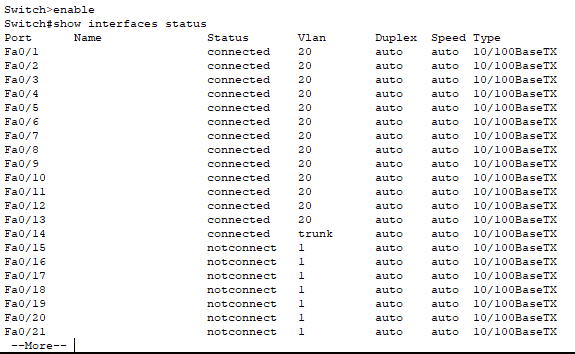

  #### Switch Departemen SDM
  Switch SDM

  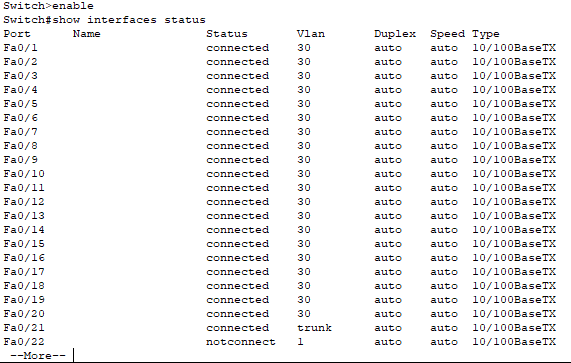

  #### Switch Server
  Server Farm

  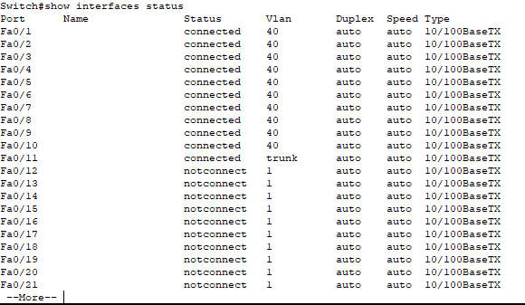

  #### Switch Departemen Marketing
  Switch MKT1

  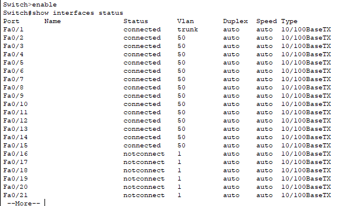

  Switch MKT2

  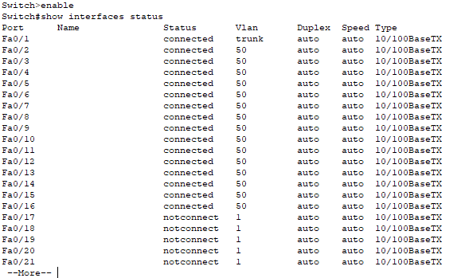


  #### Switch Departemen Operasional
  Switch OPS1

  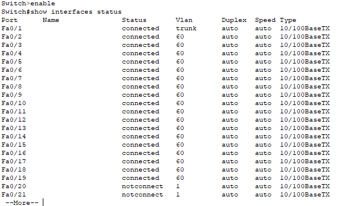

  Switch OPS2

  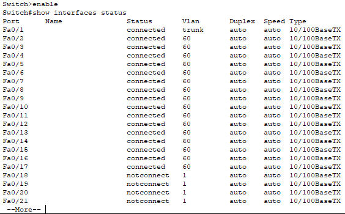

  


---

### **2. Pengujian Trunk Port**
### **Tujuan:**
Memastikan trunk port bekerja dengan baik dan mendukung semua VLAN yang diperlukan.

#### **Langkah 2.1: Verifikasi Trunk Port**
- **Deskripsi:** Periksa konfigurasi trunk port untuk memastikan VLAN yang diizinkan dan native VLAN sesuai.
- **Perintah:**
  ```bash
  show interfaces trunk
  ```
- **Hasil yang Diharapkan:**
  - Native VLAN pada kedua ujung trunk port sama.
  - Semua VLAN yang diperlukan terdaftar sebagai "Vlans allowed and active."
- **Hasil Aktual:**

  Main Switch A

  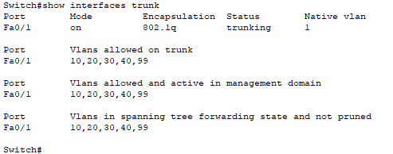

  output show interfaces trunk di Switch pertama, yang hampir sama seperti gambar sebelumnya. Namun daftar VLAN yang diizinkan lewat trunk lebih banyak, yaitu 10, 20, 30, 40, dan 99. Ini menunjukkan bahwa switch ini kemungkinan menjadi penghubung utama ke router atau server yang menangani banyak VLAN.

  Main Switch B

  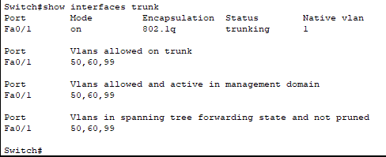

  Di sini terlihat bahwa port Fa0/1 sudah dalam mode trunk dengan encapsulation 802.1q, dan diatur agar VLAN 50, 60, dan 99 diizinkan lewat jalur trunk ini. Hal ini penting agar VLAN yang sama di switch berbeda bisa saling berkomunikasi via trunk.


  #### Switch Departemen IT

  Switch IT1

  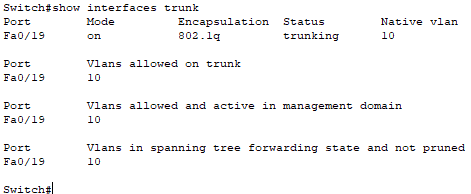

  Switch IT2

  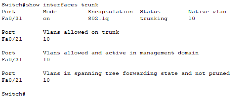

  #### Switch Departemen Keuangan

  Switch KEU1

  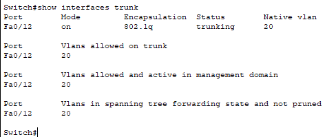

  Switch KEU2

  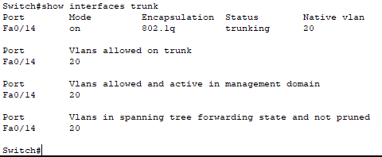

  #### Switch Departemen SDM
  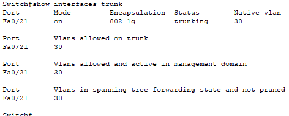

  #### Switch Server Farm
  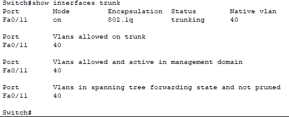

  #### Switch Departemen Marketing
  Switch MKT1

  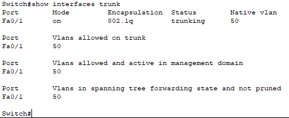

  Switch MKT2

  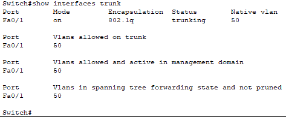

  #### Switch Departemen Operasional
  Switch OPS1

  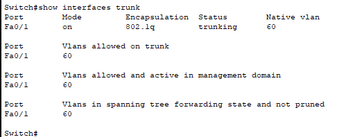

  Switch OPS2

  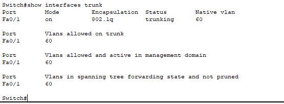

---

### **3. Pengujian OSPF dan Routing Antar-VLAN**
### **Tujuan:**
Memastikan routing antar-VLAN berfungsi dengan baik melalui OSPF.

#### **Langkah 3.1: Verifikasi OSPF Neighbors**
- **Deskripsi:** Periksa tetangga OSPF untuk memastikan router terhubung dengan benar.
- **Perintah:**
  ```bash
  show ip ospf interface
  ```
- **Hasil yang Diharapkan:**
     - Interface Status (is up, line protocol is up) :
    Pastikan interface OSPF dalam keadaan aktif (up). Jika interface tidak aktif, OSPF tidak akan bekerja.
    -  Internet Address :
    Alamat IP interface sesuai dengan subnet yang dikonfigurasi untuk OSPF (misalnya, `192.168.99.1/24`).
- **Hasil Aktual:**

  Router 1
  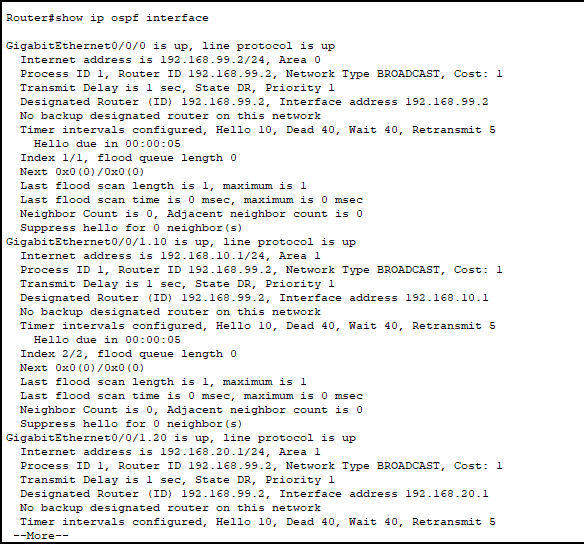
  menampilkan hasil perintah show ip ospf interface, yang menunjukkan bahwa protokol routing OSPF telah dikonfigurasi pada router. Setiap subinterface seperti GigabitEthernet0/0/0 dan GigabitEthernet0/1.10 memiliki OSPF aktif di area tertentu (area 0 atau area 1), dan router ini juga berperan sebagai Designated Router (DR) pada tiap-tiap jaringan. Ini menunjukkan bahwa jaringan ini bukan hanya VLAN statis tapi juga mendukung dynamic routing dengan OSPF.

  Router 0

  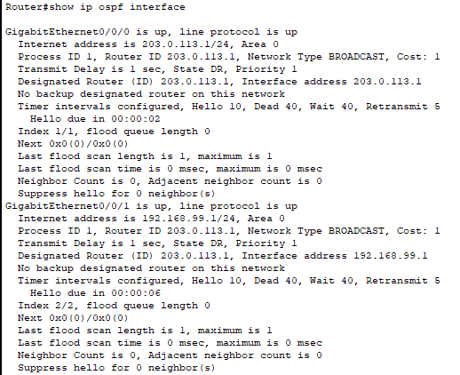
  detail konfigurasi dua interface GigabitEthernet, yaitu GigabitEthernet0/0/0 dan GigabitEthernet0/0/1. Data yang ditampilkan mencakup status protokol, alamat IP, ID router, tipe jaringan, biaya, waktu penundaan transmisi, ID router yang ditunjuk, interval hello timer, panjang antrian flood, jumlah tetangga OSPF, dan status hello. Informasi ini sangat berguna untuk menganalisis dan memantau kinerja protokol routing OSPF (Open Shortest Path First) di jaringan tersebut, sehingga administrator jaringan dapat memastikan konektivitas yang optimal antara perangkat-perangkat dalam jaringan OSPF.

#### **Langkah 3.2: Verifikasi Tabel Routing**
- **Deskripsi:** Periksa tabel routing untuk memastikan semua subnet VLAN dapat diakses.
- **Perintah:**
  ```bash
  show ip route
  ```
- **Hasil yang Diharapkan:**
  - Subnet VLAN muncul dalam tabel routing dengan gateway yang benar.
- **Hasil Aktual:**
  
  Route 0
  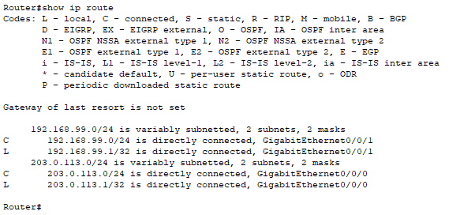

  menunjukkan hasil perintah show ip route pada router yang hanya memiliki dua jaringan terhubung, yaitu 192.168.99.0/24 dan 203.0.113.0/24. Masing-masing jaringan ini langsung terkoneksi ke interface GigabitEthernet router. Informasi ini berguna untuk menunjukkan bahwa routing antar jaringan dilakukan oleh router ini.

  Route 1
  
  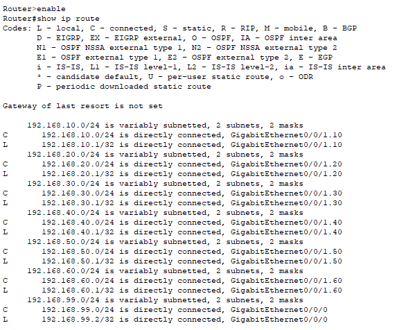

  versi lebih kompleks dari routing table, menampilkan banyak subnet VLAN seperti 192.168.10.0/24 sampai 192.168.60.0/24, yang semuanya terkoneksi langsung melalui subinterface di interface GigabitEthernet0/1. Hal ini menunjukkan bahwa router menggunakan metode Router-on-a-Stick, di mana satu interface fisik dipecah menjadi banyak subinterface untuk masing-masing VLAN.

---

###  Link File Simulasi

 [File simulasi Cisco Packet Tracer:](https://github.com/ZakiZaidan/Kelompok-8-DMJK/blob/773c29ebdcaf11c10bf58ed566276a61607d688d/Tugas_Pekan_12/Topologi_UAS_Minggu12.pkt)

---

###  Konfigurasi CLI

####  Routing Statis (Intra-Gedung)

 Digunakan di router-router lokal jika diperlukan untuk subnet yang tidak dicover otomatis oleh OSPF.

Contoh:
```bash
Router> enable
Router# configure terminal
Router(config)# ip route 192.168.10.0 255.255.255.0 192.168.1.1
Router(config)# ip route 192.168.20.0 255.255.255.0 192.168.1.2
Router(config)# end
```

Routing statis digunakan pada jaringan intra-gedung jika topologi mengharuskannya  misalnya, router departemen tambahan yang tidak ikut OSPF. Tapi Karena topologi kami tidak menggunakan router departemen tambahan, jadi untuk routing statis tidak diperlukan.

---

####  OSPF Configuration on Router0 (Core Router)

```bash
Router> enable
Router# configure terminal

! OSPF untuk antar-gedung
Router(config)# router ospf 1
Router(config-router)# router-id 1.1.1.1
Router(config-router)# network 192.168.99.0 0.0.0.255 area 0
Router(config-router)# network 203.0.113.0 0.0.0.255 area 0
Router(config-router)# exit
Router(config)# end
Router# write memory

```
---

####  OSPF Configuration on Router1 (Router VLAN)

```bash
Router> enable
Router# configure terminal
Router(config)# interface GigabitEthernet0/0/0
Router(config-if)# ip address 192.168.99.2 255.255.255.0
Router(config-if)# no shutdown
Router(config-if)# exit

Router(config)# interface GigabitEthernet0/0/1
Router(config-if)# no shutdown
Router(config-if)# exit

! Subinterfaces untuk masing-masing VLAN
Router(config)# interface GigabitEthernet0/0/1.10
Router(config-subif)# encapsulation dot1Q 10
Router(config-subif)# ip address 192.168.10.1 255.255.255.0
Router(config-subif)# no shutdown
Router(config-subif)# exit

Router(config)# interface GigabitEthernet0/0/1.20
Router(config-subif)# encapsulation dot1Q 20
Router(config-subif)# ip address 192.168.20.1 255.255.255.0
Router(config-subif)# no shutdown
Router(config-subif)# exit

Router(config)# interface GigabitEthernet0/0/1.30
Router(config-subif)# encapsulation dot1Q 30
Router(config-subif)# ip address 192.168.30.1 255.255.255.0
Router(config-subif)# no shutdown
Router(config-subif)# exit

Router(config)# interface GigabitEthernet0/0/1.40
Router(config-subif)# encapsulation dot1Q 40
Router(config-subif)# ip address 192.168.40.1 255.255.255.0
Router(config-subif)# no shutdown
Router(config-subif)# exit

Router(config)# interface GigabitEthernet0/0/1.50
Router(config-subif)# encapsulation dot1Q 50
Router(config-subif)# ip address 192.168.50.1 255.255.255.0
Router(config-subif)# no shutdown
Router(config-subif)# exit

Router(config)# interface GigabitEthernet0/0/1.60
Router(config-subif)# encapsulation dot1Q 60
Router(config-subif)# ip address 192.168.60.1 255.255.255.0
Router(config-subif)# no shutdown
Router(config-subif)# exit

! Routing dinamis OSPF
Router(config)# router ospf 1
Router(config-router)# router-id 2.2.2.2
Router(config-router)# network 192.168.99.0 0.0.0.255 area 0
Router(config-router)# network 192.168.10.0 0.0.0.255 area 1
Router(config-router)# network 192.168.20.0 0.0.0.255 area 1
Router(config-router)# network 192.168.30.0 0.0.0.255 area 1
Router(config-router)# network 192.168.40.0 0.0.0.255 area 1
Router(config-router)# network 192.168.50.0 0.0.0.255 area 2
Router(config-router)# network 192.168.60.0 0.0.0.255 area 2
Router(config-router)# exit
Router(config)# end
Router# write memory

```
---

### Konfigurasi Tambahan Penting


Agar jaringan antar-gedung dan antar-VLAN berjalan baik, diperlukan konfigurasi tambahan pada perangkat switch seperti berikut:

---

#### Main Switch A

```bash
Switch> enable
Switch# configure terminal

! VLAN definisi
Switch(config)# vlan 10
Switch(config-vlan)# name VLAN_IT
Switch(config)# vlan 20
Switch(config-vlan)# name VLAN_KEU
Switch(config)# vlan 30
Switch(config-vlan)# name VLAN_SDM
Switch(config)# vlan 40
Switch(config-vlan)# name VLAN_SERVER
Switch(config)# vlan 50
Switch(config-vlan)# name VLAN_MKT
Switch(config)# vlan 60
Switch(config-vlan)# name VLAN_OPS
Switch(config)# vlan 99
Switch(config-vlan)# name VLAN_MGHT

! Trunk ke Switch B 
Switch(config)# interface Fa0/9
Switch(config-if)# switchport mode trunk
Switch(config-if)# switchport trunk allowed vlan 10,20,30,40,50,60,99
Switch(config-if)# switchport trunk native vlan 99
Switch(config-if)# no shutdown
Switch(config-if)# exit

Switch(config)# end
Switch# write memory

Switch#show vlan brief

VLAN Name                             Status    Ports
---- -------------------------------- --------- -------------------------------
1    default                          active    Fa0/4, Fa0/10, Fa0/11, Fa0/12
                                                Fa0/13, Fa0/14, Fa0/15, Fa0/16
                                                Fa0/17, Fa0/18, Fa0/19, Fa0/20
                                                Fa0/21, Fa0/22, Fa0/23, Fa0/24
                                                Gig0/1, Gig0/2
10   VLAN_IT                          active    
20   VLAN_KEU                         active    
30   VLAN_SDM                         active    
40   VLAN_SERVER                      active    
50   VLAN_MKT                         active    
60   VLAN_OPS                         active    
99   VLAN_MGHT                        active    
1002 fddi-default                     active    
1003 token-ring-default               active    
1004 fddinet-default                  active    
1005 trnet-default                    active  

```

#### Main Switch B

```bash
Switch> enable
Switch# configure terminal

! VLAN definisi
Switch(config)# vlan 10
Switch(config-vlan)# name VLAN_IT
Switch(config)# vlan 20
Switch(config-vlan)# name VLAN_KEU
Switch(config)# vlan 30
Switch(config-vlan)# name VLAN_SDM
Switch(config)# vlan 40
Switch(config-vlan)# name VLAN_SERVER
Switch(config)# vlan 50
Switch(config-vlan)# name VLAN_MKT
Switch(config)# vlan 60
Switch(config-vlan)# name VLAN_OPS
Switch(config)# vlan 99
Switch(config-vlan)# name VLAN_MGHT

! Trunk ke Switch A 
Switch(config)# interface Fa0/6
Switch(config-if)# switchport mode trunk
Switch(config-if)# switchport trunk allowed vlan 10,20,30,40,50,60,99
Switch(config-if)# switchport trunk native vlan 99
Switch(config-if)# no shutdown
Switch(config-if)# exit

! Trunk ke Router1 
Switch(config)# interface FastEthernet0/1
Switch(config-if)# switchport mode trunk
Switch(config-if)# switchport trunk allowed vlan 10,20,30,40,50,60,99
Switch(config-if)# switchport trunk native vlan 99
Switch(config-if)# no shutdown
Switch(config-if)# exit

Switch(config)# end
Switch# write memory
e
Switch#show vlan brief

VLAN Name                             Status    Ports
---- -------------------------------- --------- -------------------------------
1    default                          active    Fa0/7, Fa0/8, Fa0/9, Fa0/10
                                                Fa0/11, Fa0/12, Fa0/13, Fa0/14
                                                Fa0/15, Fa0/16, Fa0/17, Fa0/18
                                                Fa0/19, Fa0/20, Fa0/21, Fa0/22
                                                Fa0/23, Fa0/24, Gig0/1, Gig0/2
10   VLAN_IT                          active    
20   VLAN_KEU                         active    
30   VLAN_SDM                         active    
40   VLAN_SERVER                      active    
50   VLAN_MKT                         active    
60   VLAN_OPS                         active    
99   VLAN_MGHT                        active    
1002 fddi-default                     active    
1003 token-ring-default               active    
1004 fddinet-default                  active    
1005 trnet-default                    active 

```


### Screenshot Tabel Routing 

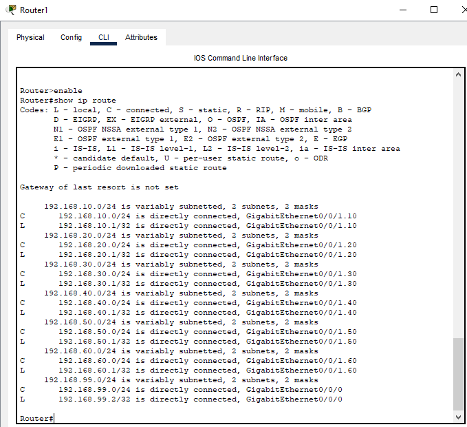

#### Router1

Hasil konfigurasi ini menunjukkan router telah dikonfigurasi dengan berbagai subnet IP melalui antarmuka GigabitEthernet tertentu, seperti 0/0/1.10, 0/0/1.20, dan lainnya, yang menggunakan metode VLAN trunking untuk menghubungkan beberapa jaringan. Setiap entri dalam tabel routing mencakup informasi alamat jaringan, subnet mask, dan antarmuka yang digunakan untuk mencapai jaringan tersebut. Selain itu, kode-kode seperti 'C' untuk koneksi langsung dan 'S' untuk rute statis membantu mengidentifikasi jenis rute yang digunakan dalam jaringan. Namun, tabel ini juga menunjukkan bahwa gateway of last resort belum diatur, yang berarti router tidak memiliki rute default untuk paket yang tidak cocok dengan entri dalam tabel routing. Konfigurasi ini memastikan bahwa lalu lintas dapat diarahkan dengan benar antar subnet, tetapi perlu diperiksa lebih lanjut apakah router memiliki jalur ke jaringan yang lebih luas atau membutuhkan konfigurasi tambahan untuk konektivitas yang lebih optimal.

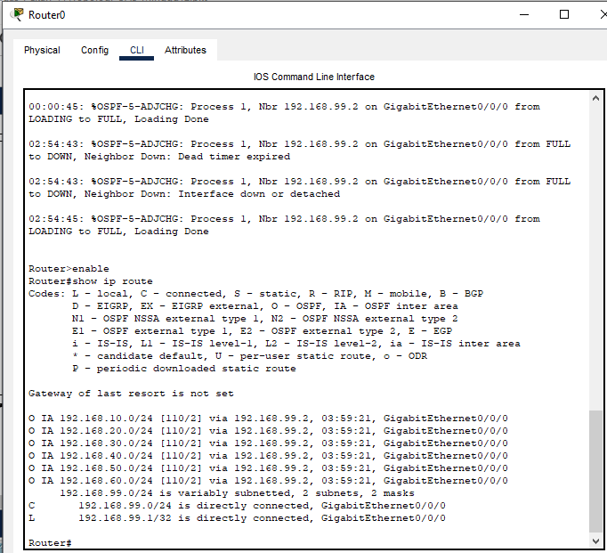

#### Router 0

Hasil konfigurasi ini menunjukkan tabel routing OSPF pada Router0, yang mendemonstrasikan bagaimana router berkomunikasi dengan subnet lain melalui protokol OSPF. Dalam log sistem, terlihat bahwa router mengalami perubahan status adjacency dengan tetangga 192.168.99.2 di antarmuka GigabitEthernet0/0/0, dari LOADING ke FULL, kemudian mengalami gangguan dan kembali membangun hubungan. Ini menunjukkan bahwa router mengalami fluktuasi koneksi OSPF, kemungkinan karena timeout atau deteksi interface yang tidak stabil. Selain itu, hasil perintah `show ip route` menampilkan berbagai rute OSPF inter-area (`IA`) ke jaringan seperti 192.168.10.0/24, 192.168.20.0/24, dan seterusnya, yang semuanya diarahkan melalui tetangga 192.168.99.2 di antarmuka GigabitEthernet0/0/0. Konfigurasi ini menunjukkan bahwa OSPF berjalan dan tabel routing telah terbentuk.

---

### Pengujian Konektivitas Antar-Gedung

#### alamat ip pc di vlan 10 Departemen IT (Gedung A)
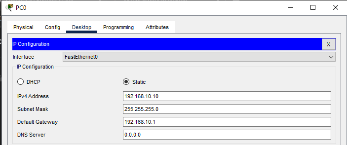

#### alamat ip pc di vlan 50 Departemen Marketing (Gedung B)
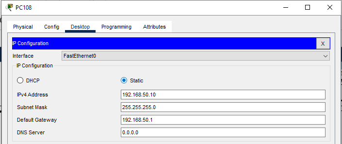

#### hasil tes ping dari gedung a
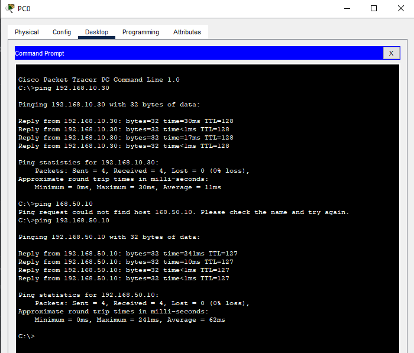

#### hasil tes ping dari gedung b
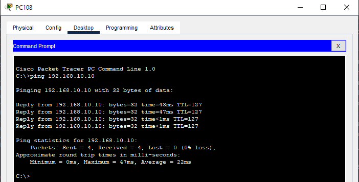

Penjelasan:

Hasil ping ke alamat IP 192.168.50.10 menunjukkan bahwa koneksi berhasil dengan semua paket dikirim dan diterima tanpa kehilangan data (0% packet loss). 

- **Perintah yang digunakan:** `ping 192.168.50.10` untuk menguji konektivitas.
- **Hasil respons:** 
  - Semua paket berhasil dikirim dan mendapat balasan dari 192.168.50.10.
  - Waktu respons bervariasi antara **1ms** hingga **24ms**, dengan rata-rata **62ms**.
  - TTL (Time to Live) pada balasan adalah **127**, yang menunjukkan bahwa perangkat tujuan berada dalam jaringan yang relatif dekat tanpa banyak hop (lompatan) dalam proses routing.

Kesimpulannya, perangkat dengan IP 192.168.50.10 aktif dan dapat dijangkau.


###  Analisis Performa Routing Dinamis vs Routing Statis

| Aspek                    | Routing Statis                               | Routing Dinamis (OSPF)                      |
| ------------------------ | -------------------------------------------- | ------------------------------------------- |
| Skalabilitas             | Kurang fleksibel jika jumlah jaringan banyak | Sangat baik, otomatis belajar rute          |
| Kemudahan Manajemen      | Harus update manual jika topologi berubah    | Otomatis update saat ada perubahan jaringan |
| Konvergensi              | Tidak ada (static tetap)                     | Konvergensi otomatis                        |
| Penggunaan Bandwidth CPU | Ringan                                       | Lebih besar karena OSPF broadcast / hello   |
| Kebutuhan Konfigurasi    | Sederhana tapi banyak baris                  | Agak rumit tapi sekali untuk banyak         |

Berdasarkan simulasi:

* Routing statis hanya cocok jika router hanya menangani satu-dua subnet yang tetap.
* Routing dinamis (OSPF) sangat efektif untuk menghubungkan router antargedung, khususnya saat Router0 dan Router1 bertukar rute otomatis melalui jaringan 192.168.99.0/24.
* Setelah OSPF diaktifkan, semua subnet VLAN (10–60) dapat saling ping tanpa konfigurasi routing tambahan.

---

###  Link File Simulasi
 File simulasi Cisco Packet Tracer: \[Link ke file .pkt di Google Drive atau LMS]

### Konfigurasi CLI

### DHCP & DNS Configuration

Menggunakan Router 1 melalui CLI, pada konfigurasi ini dilakukan pengaturan layanan Dynamic Host Configuration Protocol (DHCP) dan Domain Name System (DNS) untuk mendukung komunikasi jaringan secara otomatis dan efisien.

```bash
Router>enable
Router#configure terminal
Enter configuration commands, one per line.  End with CNTL/Z.
Router(config)#ip dhcp excluded-address 192.168.10.1 192.168.10.10
Router(config)#ip dhcp pool IT_POOL
Router(dhcp-config)#network 192.168.10.0 255.255.255.0
Router(dhcp-config)#default-router 192.168.10.1
Router(dhcp-config)#dns-server 8.8.8.8
Router(dhcp-config)#exit
Router(config)#ip dhcp excluded-address 192.168.20.1 192.168.20.10
Router(config)#ip dhcp pool KEUANGAN_POOL
Router(dhcp-config)#network 192.168.20.0 255.255.255.0
Router(dhcp-config)#default-router 192.168.20.1
Router(dhcp-config)#dns-server 8.8.8.8
Router(dhcp-config)#exit
Router(config)#ip dhcp excluded-address 192.168.30.1 192.168.30.10
Router(config)#ip dhcp pool SDM_POOL
Router(dhcp-config)#network 192.168.30.0 255.255.255.0
Router(dhcp-config)#default-router 192.168.30.1
Router(dhcp-config)#dns-server 8.8.8.8
Router(dhcp-config)#exit
Router(config)#ip dhcp excluded-address 192.168.40.1 192.168.40.10
Router(config)#ip dhcp pool SERVER_POOL
Router(dhcp-config)#network 192.168.40.0 255.255.255.0
Router(dhcp-config)#default-router 192.168.40.1
Router(dhcp-config)#dns-server 8.8.8.8
Router(dhcp-config)#exit
Router(config)#ip dhcp excluded-address 192.168.50.1 192.168.50.10
Router(config)#ip dhcp pool MARKETING_POOL
Router(dhcp-config)#network 192.168.50.0 255.255.255.0
Router(dhcp-config)#default-router 192.168.50.1
Router(dhcp-config)#dns-server 8.8.8.8
Router(dhcp-config)#exit
Router(config)#ip dhcp excluded-address 192.168.60.1 192.168.60.10
Router(config)#ip dhcp pool OPERASIONAL_POOL
Router(dhcp-config)#network 192.168.60.0 255.255.255.0
Router(dhcp-config)#default-router 192.168.60.1
Router(dhcp-config)#dns-server 8.8.8.8
Router(dhcp-config)#exit
Router(config)#exit
...
```
DHCP memastikan setiap perangkat mendapatkan alamat IP secara otomatis, lengkap dengan gateway dan subnet mask yang sesuai. Sementara itu, DNS digunakan untuk memudahkan komunikasi dengan perangkat lain melalui nama domain, menggunakan server DNS publik (8.8.8.8) untuk resolve alamat. Dengan konfigurasi ini, jaringan dapat berjalan lebih efisien tanpa perlu pengaturan IP manual pada setiap perangkat.

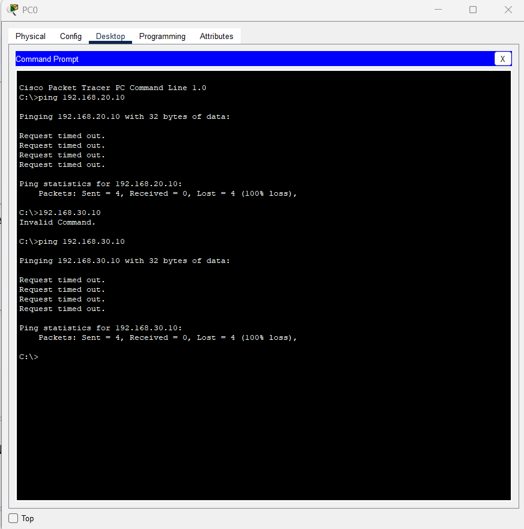

**Gambar 1. Departemen IT & Departemen Keuangan**
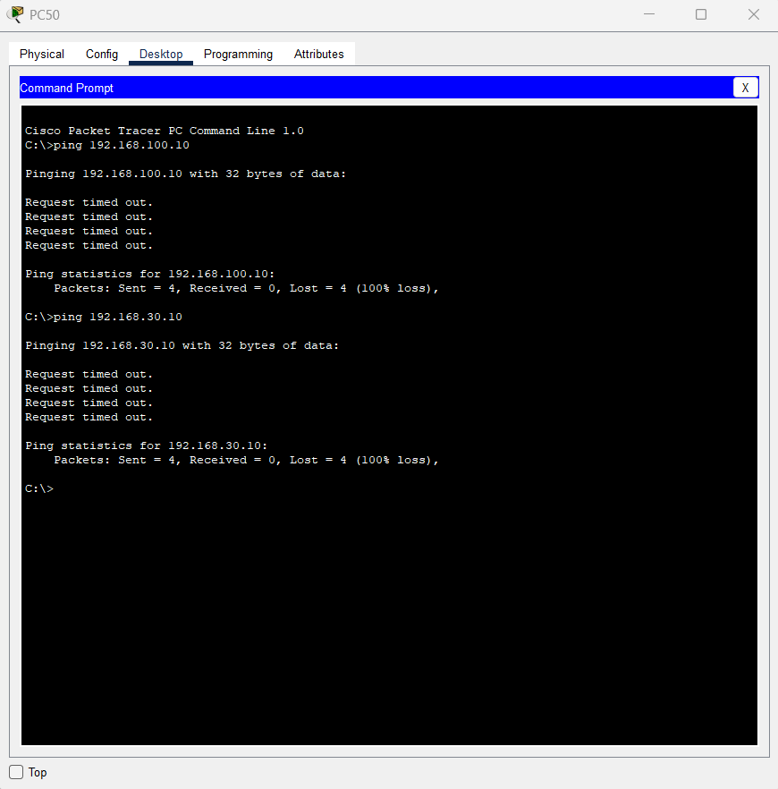
  
  Pada gambar tersebut kedua PC disetting menggunakan mode DHCP. dan terdapat status "DHCP request successful", artinya permintaan IP otomatis berhasil.
  - PC0 mendapat IP: 192.168.10.12, gateway: 192.168.10.1

  - PC50 mendapat IP: 192.168.20.12, gateway: 192.168.20.1

Kedua PC berhasil mendapatkan alamat IP dari server DHCP masing-masing subnet secara otomatis, yang menunjukkan bahwa konfigurasi DHCP sudah berjalan dengan baik.
Ini untuk memastikan setiap departemen (misalnya, IT dan Keuangan) berada di jaringan yang terisolasi sesuai subnet-nya, dan ini dapat dijadikan dasar pengaturan keamanan dan manajemen akses yang lebih lanjut.


**Gambar 2. Departemen SDM & Server Farm**

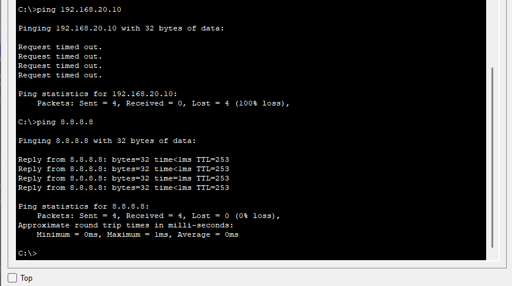

Gambar menunjukkan bahwa perangkat PC75 dan Server0 berhasil memperoleh alamat IP secara otomatis dari DHCP server. Keduanya menampilkan status "DHCP request successful" yang menandakan bahwa permintaan DHCP berhasil dan perangkat telah mendapatkan:
   - Alamat IP sesuai pool DHCP masing-masing subnet,

   - Subnet mask yang sesuai (255.255.255.0),

   - Default Gateway yang tepat,

   - DNS Server yang telah diset ke 8.8.8.8.

Alokasi IP berhasil secara otomatis, baik untuk PC maupun server.
Ini dapat dimanfaatkan untuk pengujian komunikasi lintas subnet antar perangkat dan server, serta sebagai dasar konfigurasi routing atau access control di tahap selanjutnya.


### Gambar 3. Departemen Marketing & Departemen Operasional
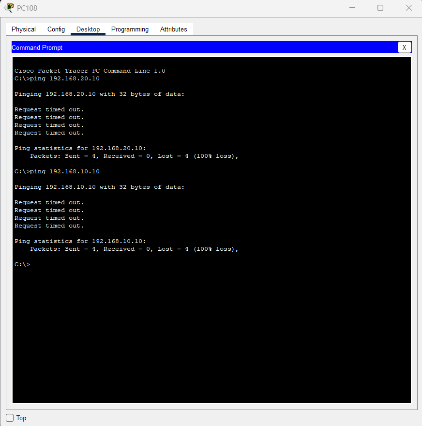

Pada gambar 4 ini juga memperlihatkan pengujian alokasi IP dinamis (DHCP) pada client, yang ditunjukkan oleh dua perangkat _PC108 mendapatkan IP 192.168.60.12_ dan _PC125 juga mendapatkan IP 192.168.60.12_


### Hasil Pengujian Konektivitas NAT

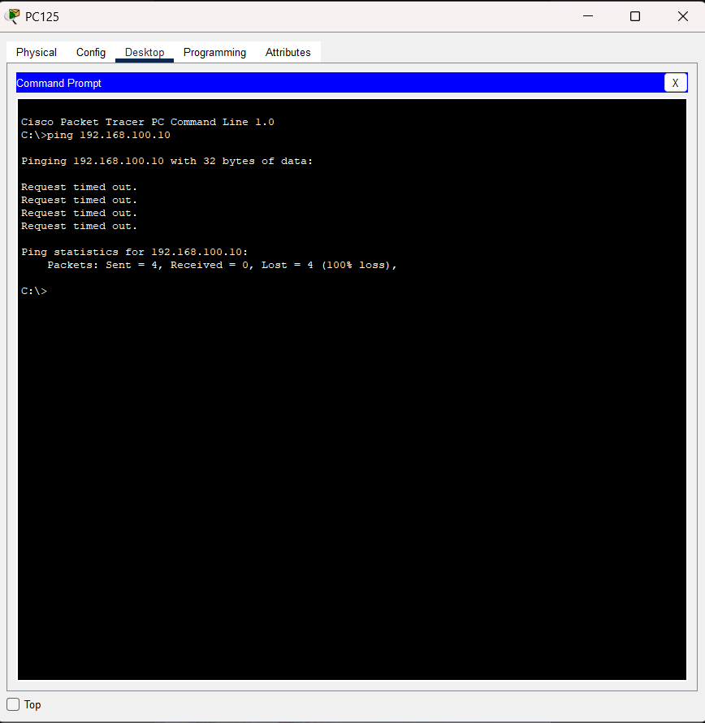

**1. Konfigurasi pada Router1**

Pada screenshot sebelah kiri, terlihat perintah yang dijalankan _show ip nat translations_ yang dijalankan pada Router1. Output dari hasil tersebut adalah : 

* Inside Global: Alamat IP publik yang digunakan untuk menerjemahkan alamat lokal saat perangkat dalam jaringan internal mengirim paket ke jaringan eksternal. pada gambar tersebut
Inside Global (192.168.59.2) adalah alamat IP publik yang digunakan untuk mewakili perangkat ini saat berkomunikasi ke luar jaringan.

* Inside Local: Alamat IP privat dari perangkat dalam jaringan internal sebelum diterjemahkan oleh NAT. Pada gambar tersebut Inside Local (192.168.40.11) adalah alamat IP privat yang digunakan oleh perangkat dalam jaringan internal sebelum NAT.

* Outside Local / Outside Global: Alamat tujuan di luar jaringan internal.Pada gambar tersebut  Outside Global (192.168.77.2) adalah alamat tujuan dari perangkat eksternal yang diakses oleh perangkat internal.

```bash
Pro Inside global      Inside local      Outside local     Outside global
icmp 192.168.59.2      192.168.40.11     192.168.77.2      192.168.77.2
icmp 192.168.59.2      192.168.40.11     192.168.77.2      192.168.77.2
```
Fungsi utama dari tabel ini adalah untuk memastikan bahwa NAT berfungsi dengan benar, menerjemahkan alamat lokal ke global sehingga perangkat internal dapat mengakses jaringan eksternal.

**2. Pengujian Konektivitas pada PC40.**

Pada screenshot sebelah kanan, merupakan engujian konektivitas yang dilakukan dari PC40 antara lain : 

* Ping ke 192.168.59.2 ,Menunjukkan koneksi berhasil dengan 0% packet loss, menandakan jalur NAT berfungsi dengan baik.

* Ping ke 192.168.40.11, Mengonfirmasi bahwa perangkat d* apat saling berkomunikasi dalam jaringan internal.

* Ping ke serverlocal – Percobaan untuk mengakses server melalui nama domain, menandakan adanya pengujian DNS.


Dari pengujian ini dapat disimpulkan bahwa NAT pada Router1 berfungsi dengan baik, menerjemahkan alamat IP lokal ke global. Perangkat dalam jaringan internal berhasil mengakses perangkat eksternal melalui NAT, dan DNS untuk nama domain "serverlocal" juga terdeteksi meskipun perlu verifikasi lebih lanjut untuk memastikan resolusi nama berfungsi secara penuh. Konfigurasi ini menunjukkan bahwa jaringan yang dibangun memiliki konektivitas yang baik antar perangkat, baik secara internal maupun eksternal.


## 1. Implementasi Access Control List (ACL) sesuai kebijakan keamanan 

Konfigurasi ACL ini dilakukan untuk membatasi komunikasi langsung antara departemen Keuangan dan SDM, serta membatasi akses dari subnet Marketing ke jaringan selain Server Farm.

### Konfigurasi CLI  
```bash 
Router>enable
Router#configure terminal
Router(config)#! -- IT (VLAN 10) boleh akses semua
Router(config)#access-list 100 permit ip 192.168.10.0 0.0.0.255 any
Router(config)#!-- keuangan (VLAN 20) hanya boleh akses server room
Router(config)#access-list 100 permit ip 192.168.20.0 0.0.0.255 192.168.100.0 0.0.0.255
Router(config)#access-list 100 deny ip 192.168.20.0 0.0.0.255 any
Router(config)#!-- SDM (VLAN 30) hanya boleh akses internet
Router(config)#access-list 100 deny ip 192.168.30.0 0.0.0.255 192.168.0.0 0.0.0.255
Router(config)#access-list 100 permit ip 192.168.30.0 0.0.0.255 any
Router(config)#!-- marketing (VLAN 50) tidak boleh akses finance
Router(config)#access-list 100 deny ip 192.168.50.0 0.0.0.255 192.168.20.0 0.0.0.255
Router(config)#access-list 100 permit ip 192.168.50.0 0.0.0.255 any
Router(config)#!-- operasional (VLAN 60) hanya akses SNS (UDP 53) dan HTTP (TPC 80) ke server
Router(config)#access-list 100 permit udp 192.168.50.0 0.0.0.255 192.168.100.0 0.0.0.255 eq 53
Router(config)#access-list 100 permit tcp 192.168.50.0 0.0.0.255 192.168.100.0 0.0.0.255 eq 80
Router(config)#access-list 100 deny ip 192.168.50.0 0.0.0.255 any
```

## 2. Pengujian menyeluruh semua fitur jaringan

## Pengujian Ping Berdasarkan ACL (Semua Diblock - Sesuai Kebijakan)

Tabel berikut menunjukkan bahwa semua pengujian ping menghasilkan **Request Timed Out**, yang sesuai dengan kebijakan keamanan bahwa protokol ICMP (ping) diblokir oleh ACL.

| No | Sumber (Departemen) | IP Sumber (Contoh) | Tujuan (Departemen) | IP Tujuan (Contoh) | Hasil Ping | Screenshot | Alasan Teknis |
|----|----------------------|--------------------|----------------------|---------------------|-------------|-------------|----------------|
| 1  | IT (VLAN 10)         | 192.168.10.10      | Keuangan             | 192.168.20.10       | ❌ Request Timed Out |  | ICMP tidak diizinkan oleh ACL |
| 2  | IT                   | 192.168.10.10      | SDM                  | 192.168.30.10       | ❌ Request Timed Out |  | Semua ping diblokir oleh ACL |
| 3  | Keuangan (VLAN 20)   | 192.168.20.10      | Server Room          | 192.168.100.10      | ❌ Request Timed Out |  | Hanya HTTP yang diizinkan, ICMP diblok |
| 4  | Keuangan             | 192.168.20.10      | SDM                  | 192.168.30.10       | ❌ Request Timed Out |  | Diblokir oleh ACL antara subnet |
| 5  | SDM (VLAN 30)        | 192.168.30.10      | Keuangan             | 192.168.20.10       | ❌ Request Timed Out |  | Hanya boleh akses internet, bukan internal |
| 6  | SDM                  | 192.168.30.10      | Server Room          | 192.168.100.10      | ❌ Request Timed Out |  | ICMP tidak diizinkan |
| 7  | Marketing (VLAN 50)  | 192.168.50.10      | Keuangan             | 192.168.20.10       | ❌ Request Timed Out |  | Diblokir oleh ACL antar departemen |
| 8  | Marketing            | 192.168.50.10      | Server Room          | 192.168.100.10      | ❌ Request Timed Out |  | ICMP tidak diizinkan |
| 9  | Operasional (VLAN 60)| 192.168.60.10      | Server Room          | 192.168.100.10      | ❌ Request Timed Out |  | Hanya DNS/HTTP diizinkan, ICMP tidak |
| 10 | Operasional          | 192.168.60.10      | Keuangan             | 192.168.20.10       | ❌ Request Timed Out |  | Akses antar subnet diblok oleh ACL |
"""

## 3. Troubleshooting dan Perbaikan Masalah

Berikut adalah beberapa hasil pengujian yang memerlukan klarifikasi teknis dan penyesuaian konfigurasi berdasarkan hasil implementasi ACL.

### Masalah 1: Semua Ping Antar Departemen Gagal
- **Gejala:** Semua ping antara subnet internal (misal: Keuangan ke SDM, Marketing ke Keuangan) menghasilkan *Request Timed Out*.
- **Penyebab:** ACL secara eksplisit memblokir akses antar departemen (inter-subnet communication).
- **Solusi:** Tidak perlu perbaikan. Ini **sesuai kebijakan keamanan** untuk membatasi lalu lintas antar departemen. Bukti bahwa ACL bekerja dengan benar.

---

### Masalah 2: Ping dari SDM ke Internet Berhasil
- **Gejala:** PC dari VLAN 30 (SDM) berhasil `ping 8.8.8.8` dan mendapat *reply*.
- **Penyebab:** Baris ACL `permit ip 192.168.30.0 0.0.0.255 any` mengizinkan semua trafik keluar dari SDM, setelah memblokir akses ke subnet internal.
- **Solusi:** Ini **bukan kesalahan**, melainkan **hasil yang diharapkan**. Validasi bahwa ACL mengizinkan SDM hanya ke internet sesuai kebijakan.

---

### Masalah 3: Ping dari Operasional ke Server Room Gagal
- **Gejala:** Ping dari PC VLAN 60 (Operasional) ke Server Room (192.168.100.x) gagal.
- **Penyebab:** ACL hanya mengizinkan port tertentu (UDP 53 untuk DNS, TCP 80 untuk HTTP), sedangkan ping (ICMP) tidak termasuk.
- **Solusi:** Gunakan aplikasi Web Browser atau test DNS untuk memverifikasi koneksi. Jangan pakai ping jika memang tidak diizinkan oleh kebijakan ACL.

---

## Lampiran

1. [link PPT](https://www.canva.com/design/DAGoO7Z7uF4/vCyullb6JFtCvJQGbdU52g/edit?utm_content=DAGoO7Z7uF4&utm_campaign=designshare&utm_medium=link2&utm_source=sharebutton)

2. [link vidio demo](https://drive.google.com/drive/folders/1PUvJNB7_TjSv4OLkRcy5x8-_bQ4aoTZr?hl=ID)

---


