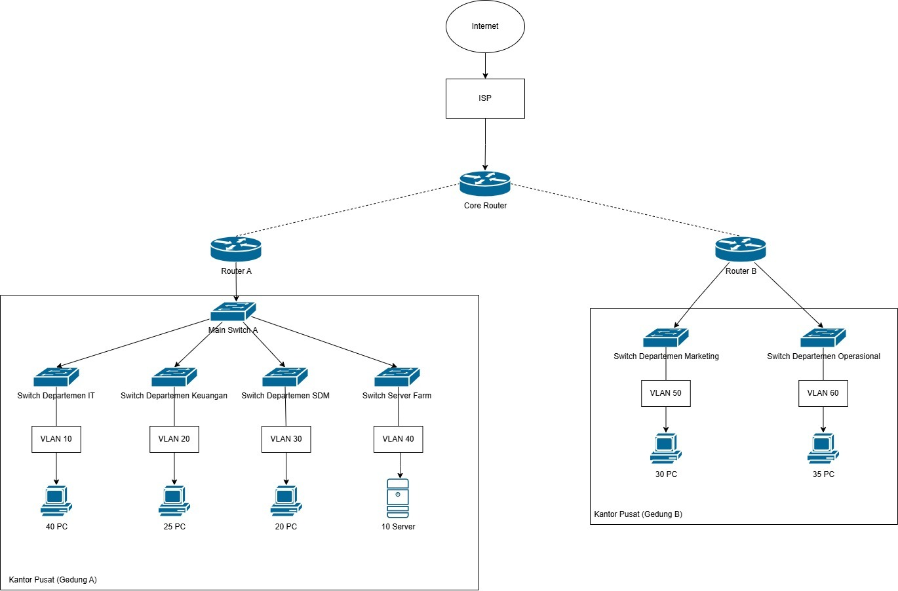

**Dokumen Perencanaan Proyek: Perancangan Topologi Jaringan Enterprise PT. Nusantara Network**

**Disusun oleh Tim [8]:**

1.  **Adhitya Hermawan** - Network Architect
2.  **Achmad Zaki Zaidan** - Network Engineer
3.  **Amalia Tiara Rezfani** - Network Services Specialist
4.  **Faradila Zakiah Nur Hafitsa** - Security & Documentation Specialist

**Tanggal Pengumpulan:** Minggu, [Pekan 9], [2025]

---
**Daftar Isi**

1.  Pendahuluan
    1.1. Latar Belakang
    1.2. Tujuan Proyek
    1.3. Ruang Lingkup Proyek
2.  Pembagian Kelompok dan Peran
3.  Analisis Kebutuhan Jaringan PT. Nusantara Network
    3.1. Struktur Organisasi & Lokasi
    3.2. Kebutuhan Segmentasi dan Keamanan (VLAN & ACL)
    3.3. Kebutuhan Konektivitas (Inter-VLAN, WAN, Internet)
    3.4. Kebutuhan Layanan Jaringan (DHCP, DNS, NAT)
    3.5. Kebutuhan Manajemen & Skalabilitas
4.  Timeline Rencana Kerja Proyek (Pekan 9-15)
5.  Sketsa Awal Desain Jaringan
    5.1. Pendekatan Desain
    5.2. Deskripsi Tekstual Sketsa Awal
6.  Kendala dan Solusi
7.  Kesimpulan
8.  Lampiran
---

**1. Pendahuluan**

**1.1. Latar Belakang**
PT. Nusantara Network adalah perusahaan yang bergerak di bidang teknologi informasi dan tengah mengalami perkembangan pesat. Dengan operasi yang tersebar di dua lokasi, yaitu Kantor Pusat (Gedung A) dan Kantor Cabang (Gedung B), perusahaan ini memiliki empat departemen utama di kantor pusat—IT, Keuangan, SDM, dan Server Farm—serta dua departemen tambahan di kantor cabang—Marketing dan Operasional. Seiring dengan meningkatnya kompleksitas operasional dan kebutuhan komunikasi antar lokasi, infrastruktur jaringan yang ada saat ini tidak lagi memadai. Oleh karena itu, proyek ini bertujuan untuk merancang dan mensimulasikan sebuah infrastruktur jaringan enterprise yang andal, aman, efisien, dan mudah dikelola. Solusi yang dirancang akan mencakup segmentasi jaringan melalui VLAN untuk setiap departemen, koneksi WAN antar gedung, NAT untuk akses internet, DHCP dan DNS untuk layanan jaringan otomatis, pengamanan antar departemen menggunakan Access Control List (ACL), serta routing dinamis berbasis OSPF. Selain itu, sistem juga akan dilengkapi dengan monitoring dan manajemen jaringan terpusat guna memastikan performa dan keamanan jaringan secara menyeluruh.

**1.2. Tujuan Proyek**
Tujuan utama dari proyek akhir semester ini adalah:
* Merancang infrastruktur jaringan yang robust, scalable, dan aman sesuai dengan struktur organisasi dan kebutuhan operasional PT. Nusantara Network.
* Mensimulasikan implementasi desain jaringan menggunakan Cisco Packet Tracer untuk menguji fungsionalitas dan efektivitas jaringan.
* Menerapkan segmentasi jaringan menggunakan VLAN untuk setiap departemen (IT, Keuangan, SDM, Server Farm, Marketing, dan Operasional) demi keamanan dan efisiensi manajemen lalu lintas jaringan.
* Mengkonfigurasi routing inter-VLAN dan routing dinamis (OSPF) untuk mendukung konektivitas antar gedung melalui jaringan WAN, dengan mempertimbangkan keterbatasan bandwidth.
* Mengimplementasikan layanan DHCP untuk alokasi IP otomatis di seluruh departemen, serta layanan DNS untuk resolusi nama domain internal dan eksternal.
* Menerapkan Network Address Translation (NAT) agar perangkat internal dapat terhubung ke internet melalui koneksi ISP yang tersedia.
* Menggunakan Access Control Lists (ACL) untuk membatasi dan mengendalikan akses antar departemen berdasarkan kebijakan keamanan yang ditetapkan.
* Mendokumentasikan seluruh proses perancangan, implementasi, dan pengujian jaringan secara lengkap dan sistematis.
* Meningkatkan kemampuan kerja sama tim, manajemen proyek, serta keterampilan presentasi teknis bagi seluruh anggota kelompok.

**1.3. Ruang Lingkup Proyek**
Lingkup proyek ini meliputi serangkaian aktivitas teknis dan dokumentatif untuk membangun infrastruktur jaringan enterprise berbasis studi kasus PT. Nusantara Network. Kegiatan utama dalam proyek ini mencakup:

*   Melakukan analisis kebutuhan jaringan berdasarkan struktur organisasi dan operasional perusahaan.
*   Mendesain topologi jaringan secara fisik maupun logis untuk kedua gedung (pusat dan cabang).
*   Membuat skema pengalamatan IP yang efisien menggunakan teknik subnetting.
*   Mengatur segmentasi jaringan dengan konfigurasi VLAN dan trunking pada perangkat switch.
*   Mengimplementasikan routing antar VLAN untuk memastikan komunikasi antar departemen.
*   Mengkonfigurasi protokol routing dinamis (OSPF) antara router utama (Core, Router A, Router B) untuk manajemen rute otomatis.
*   Menyimulasikan konektivitas antar gedung (Gedung A dan Gedung B) menggunakan jaringan WAN.
*   Menyediakan layanan alokasi IP otomatis menggunakan DHCP untuk masing-masing VLAN.
*   Membangun layanan DNS internal untuk kebutuhan resolusi nama dengan domain `nusantara-network.local`.
*   Mengimplementasikan NAT (PAT/Overload) pada Core Router untuk memungkinkan akses internet dari jaringan internal.
*   Menetapkan kebijakan keamanan melalui konfigurasi Access Control List (ACL) baik standar maupun extended.
*   Melakukan pengujian menyeluruh terhadap konektivitas, layanan jaringan, serta fitur keamanan.
*   Menyusun dokumentasi teknis yang komprehensif serta menyiapkan materi presentasi akhir proyek.
*   Membuat video demo/tutorial sebagai pelengkap hasil implementasi.

**2. Pembagian Kelompok dan Peran**

Berdasarkan hasil kesepakatan bersama dalam tim, berikut adalah struktur pembagian peran beserta tanggung jawab utama masing-masing anggota:

* **Network Architect – Adhitya**  
  Bertanggung jawab atas perancangan topologi jaringan secara menyeluruh, termasuk pembuatan skema pengalamatan IP dan subnetting. Adhitya juga akan menyusun dokumentasi visual (diagram) dan tertulis yang menggambarkan rancangan jaringan secara sistematis.

* **Network Engineer – Zaki**  
  Fokus utama Zaki adalah mengimplementasikan konfigurasi routing (baik statis maupun dinamis), mengatur VLAN dan trunking antar switch, serta menangani penghubung antar gedung melalui jaringan WAN agar dapat terintegrasi dengan baik.

* **Network Services Specialist – Tiara**  
  Tiara bertanggung jawab dalam penerapan layanan jaringan seperti DHCP untuk alokasi IP otomatis, DNS untuk resolusi nama, dan NAT untuk koneksi ke internet. Bila diperlukan, ia juga akan menangani konfigurasi dasar pada server dan memastikan layanan berjalan lancar.

* **Security & Documentation Specialist – Fara**  
  Fara akan menangani penerapan Access Control List (ACL) sebagai bagian dari kebijakan keamanan jaringan. Ia juga bertugas melakukan pengujian terhadap keamanan jaringan, menyusun dokumentasi proyek secara keseluruhan, dan mempersiapkan materi presentasi akhir.

Seluruh anggota kelompok akan bekerja sama secara aktif dalam setiap tahap proyek, guna memastikan pemahaman yang merata serta kelancaran dan keberhasilan proses perancangan hingga implementasi jaringan.

**3. Analisis Kebutuhan Jaringan PT. Nusantara Network**

Berdasarkan studi kasus, kebutuhan jaringan PT. Nusantara Network dianalisis sebagai berikut:

**3.1. Struktur Organisasi & Lokasi**
Struktur organisasi PT. Nusantara Network tersebar di dua gedung, yakni Gedung A (Kantor Pusat) dan Gedung B (Kantor Cabang), masing-masing dengan jumlah perangkat yang cukup signifikan. Berikut adalah rincian kebutuhan perangkat di setiap gedung:

* **Gedung A – Kantor Pusat:**
  - **Departemen IT:** Memiliki sekitar 40 unit komputer yang terhubung dengan infrastruktur jaringan internal, termasuk perangkat pendukung seperti switch dan access point.
  - **Departemen Keuangan:** Terdiri dari 25 unit komputer yang digunakan untuk kegiatan administrasi dan pengelolaan keuangan perusahaan.
  - **Departemen SDM (HR):** Mengoperasikan sekitar 20 unit komputer untuk keperluan rekrutmen, penggajian, dan administrasi personalia.
  - **Server Farm:** Menampung 10 unit server yang melayani berbagai fungsi penting seperti DHCP, DNS, File Server, dan layanan internal lainnya.

* **Gedung B – Kantor Cabang:**
  - **Departemen Marketing:** Terdiri dari 30 komputer yang digunakan untuk kegiatan promosi, kampanye digital, dan analisis pasar.
  - **Departemen Operasional:** Menggunakan sekitar 35 komputer untuk mendukung kegiatan operasional dan logistik.

* **Estimasi Total Host Awal:**
  Jika dijumlahkan secara kasar:
  - Komputer di Gedung A: 40 (IT) + 25 (Keuangan) + 20 (SDM) = **85 unit**
  - Komputer di Gedung B: 30 (Marketing) + 35 (Operasional) = **65 unit**
  - Server: **10 unit**

  Maka total awal perangkat host adalah:
  **85 + 65 + 10 = 160 perangkat host**

Perkiraan ini belum mencakup perangkat jaringan seperti router, switch, access point, serta kemungkinan penambahan perangkat di masa depan. Oleh karena itu, desain jaringan perlu mempertimbangkan alokasi IP yang fleksibel dan mendukung skalabilitas.

**3.2. Kebutuhan Segmentasi dan Keamanan (VLAN & ACL)**
| Aspek                        | Rincian                                                                                                        |
|-----------------------------|----------------------------------------------------------------------------------------------------------------|
| **Segmentasi VLAN**         | Setiap departemen diberi VLAN tersendiri untuk memisahkan domain broadcast dan meningkatkan manajemen trafik. |
| - VLAN 10                   | Departemen IT                                                                                                 |
| - VLAN 20                   | Departemen Keuangan                                                                                           |
| - VLAN 30                   | Departemen SDM                                                                                                |
| - VLAN 40                   | Server Farm (DHCP, DNS, NAT, File Server)                                                                                             |
| - VLAN 50                   | Departemen Marketing                                                                                          |
| - VLAN 60                   | Departemen Operasional                                                                                        |
| - VLAN 99                   | VLAN Management (khusus admin)                                                                                |
| **Keamanan Jaringan (ACL)** |                                                                                                                |
| - Akses Terbatas            | Hanya VLAN tertentu yang dapat mengakses server, berdasarkan aturan ACL di router.                            |
| - Isolasi Lintas VLAN       | VLAN user tidak dapat langsung mengakses VLAN lainnya kecuali diizinkan melalui ACL.                         |
| - Akses Internet Terbatas   | Beberapa VLAN dapat dibatasi akses internetnya melalui ACL dan NAT.                                           |

**3.3. Kebutuhan Konektivitas (Inter-VLAN, WAN, Internet)**
| Jenis Konektivitas        | Penjelasan                                                                                                      |
|---------------------------|------------------------------------------------------------------------------------------------------------------|
| **Inter-VLAN Routing**     | Diperlukan untuk menghubungkan antar VLAN (misalnya, user ke server) menggunakan router (Router-on-a-Stick).   |
| **Koneksi WAN**            | Simulasi koneksi antar gedung menggunakan link serial point-to-point antar Router A dan Router B.              |
| **Routing Dinamis**        | Menggunakan OSPF untuk pertukaran informasi routing antar router di Gedung A dan B.                             |
| **Akses Internet**         | Disediakan melalui NAT (PAT) pada Core Router di Gedung A. Semua trafik keluar masuk ke internet dikontrol di sini. |
| **Redundansi (Opsional)**  | Tidak digunakan dalam skenario dasar, tetapi bisa ditambahkan pada implementasi nyata untuk keandalan tinggi.   |

**3.5. Kebutuhan Manajemen & Skalabilitas**
* **Pengelolaan Jaringan Terpusat:**  
  Infrastruktur yang dirancang harus mendukung kemudahan dalam pemantauan dan pengelolaan konfigurasi seluruh jaringan secara terpusat. Hal ini dapat dicapai melalui penerapan protokol manajemen jaringan standar seperti SNMP (Simple Network Management Protocol), serta pendokumentasian jaringan yang rapi dan konsisten untuk mempermudah administrasi dan troubleshooting.

* **Kemampuan Skalabilitas:**  
  Rancangan jaringan juga harus fleksibel terhadap pertumbuhan skala operasional perusahaan, baik dari sisi jumlah perangkat, pengguna, maupun pembentukan departemen atau layanan baru. Oleh karena itu, diperlukan pengalokasian alamat IP yang terstruktur dan mudah dikembangkan, serta penggunaan routing dinamis seperti OSPF yang memungkinkan penyesuaian jalur secara otomatis saat terjadi perubahan topologi atau ekspansi jaringan.

**4. Timeline Rencana Kerja Proyek (Pekan 9-15)**

| Pekan | Tanggal Deadline (Jumat, 23:59 WIB) | Tugas Utama Kelompok                                                                 | Deliverable                                    | Penanggung Jawab Utama Koordinasi |
| :---- | :---------------------------------- | :----------------------------------------------------------------------------------- | :--------------------------------------------- | :-------------------------------- |
| **9** | [Tanggal Pekan 9]                   | Identifikasi kebutuhan, pembagian tugas tim, diskusi ide awal, dan rancangan desain | Dokumen Perencanaan Proyek                     | Fara (Documentation)           |
| **10**| [Tanggal Pekan 10]                  | Finalisasi topologi jaringan, alokasi IP, rencana VLAN, dan pemilihan perangkat      | Dokumen Desain Jaringan (Diagram, Tabel IP)   | Adhitya (Architect)                |
| **11**| [Tanggal Pekan 11]                  | Penerapan topologi dasar, konfigurasi VLAN & trunking, serta routing antar VLAN     | Laporan Implementasi Tahap 1 + File Simulasi  | Zaki (Engineer)                  |
| **12**| [Tanggal Pekan 12]                  | Konfigurasi routing statis (opsional), implementasi OSPF antar gedung, simulasi WAN | Laporan Implementasi Tahap 2 + File Simulasi  | Zaki (Engineer)                  |
| **13**| [Tanggal Pekan 13]                  | Pengaturan layanan DHCP, DNS internal/eksternal, dan NAT untuk akses internet       | Laporan Implementasi Tahap 3 + File Simulasi  | Tiara (Services)                  |
| **14**| [Tanggal Pekan 14]                  | Implementasi ACL antar departemen, uji jaringan menyeluruh, dan troubleshooting      | Laporan Implementasi Tahap 4 + File Simulasi  | Fara (Security)                |
| **15**| **Rabu**, [Tanggal Pekan 15], 23:59 WIB | Penyusunan dokumentasi akhir, persiapan presentasi, serta pembuatan video demo     | Laporan Akhir, Video Demo, Slide Presentasi   | Fara (Documentation)           |

**5.  Sketsa Awal Desain Jaringan**

**6. Kendala dan Solusi**
| Kendala                                          | Solusi                                                                                                      |
|--------------------------------------------------|-------------------------------------------------------------------------------------------------------------|
| **Kompleksitas dalam Implementasi VLAN & ACL**    | Membuat dokumentasi yang jelas mengenai pengaturan VLAN dan ACL agar mudah dipahami oleh tim pengelola.     |
| **Keterbatasan Sumber Daya Hardware**             | Meningkatkan penggunaan perangkat virtual (virtual machines) untuk menambah kapasitas tanpa membeli hardware.|
| **Inter-VLAN Routing yang Tidak Stabil**          | Memastikan konfigurasi router Cisco dilakukan dengan benar dan menggunakan protokol routing dinamis seperti OSPF. |
| **Keamanan Jaringan yang Rentan**                 | Menggunakan perangkat firewall Cisco ASA dan memperketat pengaturan ACL pada perangkat Cisco untuk membatasi akses yang tidak sah. |

**7. Kesimpulan**
Dari hasil analisis dan perencanaan yang telah dilakukan, dapat disimpulkan bahwa desain jaringan yang terstruktur dengan baik sangat penting untuk mendukung kelancaran operasional perusahaan. Penggunaan VLAN, ACL, dan inter-VLAN routing menggunakan perangkat Cisco, seperti router dan switch Catalyst, akan membantu mengoptimalkan kinerja jaringan dan meningkatkan keamanan. Meskipun ada beberapa kendala seperti keterbatasan perangkat keras dan tantangan dalam skalabilitas, solusi yang diusulkan dapat memberikan jalan keluar yang efektif. Dengan adanya pemeliharaan dan manajemen yang baik, jaringan ini akan dapat mendukung pertumbuhan perusahaan dengan stabil.

**8. Lampiran**

